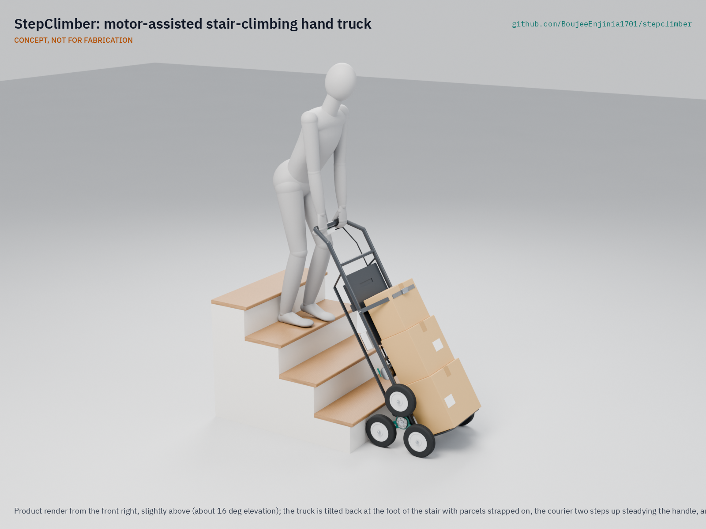
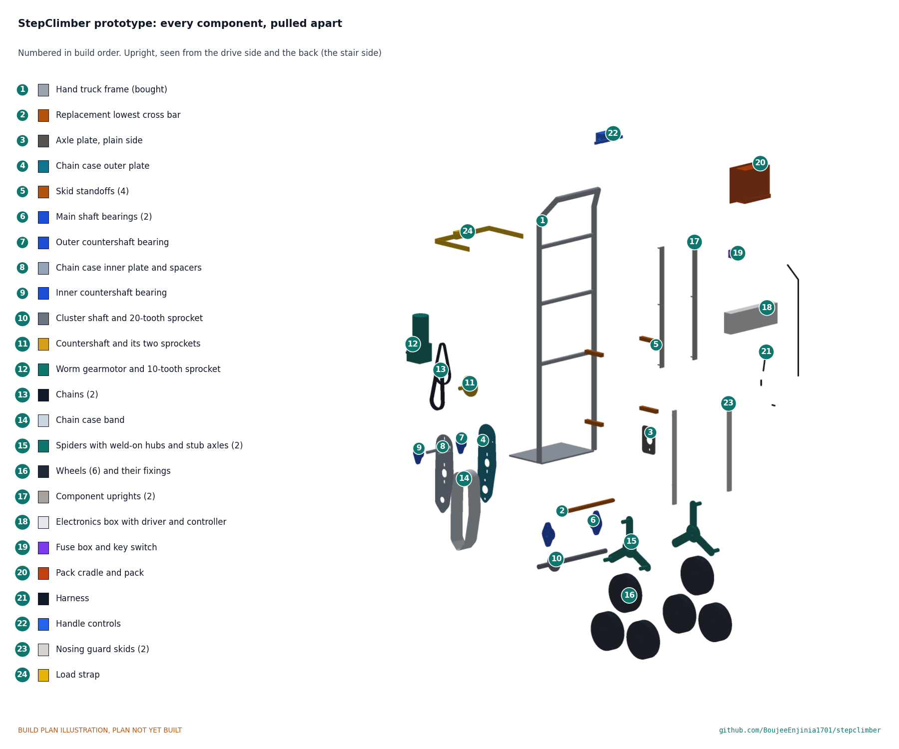

# StepClimber

     

**Area:** Mobility and Logistics · **TRL:** 3 of 9 (proof of concept on paper) · **Value-engineering target:** USD 650 (estimated cost USD 776) · **Difficulty:** 3 of 5

Motor-assisted hand truck on tri-star wheel clusters that climb stairs one step at a time, with a tilt sensor that helps the courier hold the load angle steady.

[Exploded render](media/render-exploded.png) · [Detail render](media/render-detail.png) · [Interactive 3D model](media/viewer.html) · [Concept blueprint (PDF)](media/concept-blueprint.pdf) · [General arrangement (PDF)](cad/drawings/SCM-DWG-001.pdf) · [Sizing calculations](docs/04-calcs/01-sizing.md) · [Prototype build plan](docs/05-build-plan.md) · [Design decisions](docs/06-design-decisions.md) · [Review note](docs/REVIEW.md)

## Concept rationale

A tri-star cluster is the simplest mechanism that both rolls on the flat and climbs a step: two wheels carry the truck on the sidewalk, and turning the cluster one third of a turn walks it up a riser. Manual tri-star hand trucks already prove the geometry; what they lack is a motor, so the courier still supplies every joule of lift. StepClimber adds a wheelchair-type worm gearmotor, which is self-locking and already sold with a spring-applied brake, so the load holds on the stair twice over when power is lost. The tilt sensor does not balance the truck; it slows and stops the climb so the courier, who always stands uphill, can hold the angle.

The design is open and garage-buildable because the people who need it are gig couriers and small firms, not fleet buyers. Powered stair climbers sell for about $4,400 and are closed designs. StepClimber uses a stock steel hand truck frame, laser-cut spiders, catalog chain and sprockets and a LiFePO4 pack, all of which a courier or a local workshop can buy, repair and replace.

## Burning platform

Couriers are injured at well above the average rate for workers, and lifting is the leading cause. An analysis of US emergency department data estimated about 182,000 injuries among couriers and messengers from 2015 to 2022, with annual cases rising from about 13,000 to about 35,000, and overexertion and bodily reaction behind about 42 % of them ([Iacobucci et al., *Journal of Safety Research*, 2024](https://www.sciencedirect.com/science/article/pii/S0022437524001646)). Earlier NIOSH-funded work found an injury rate of 12.8 per 100 full-time courier workers, 2.6 times the private-sector average ([Hoskin et al., CDC Stacks](https://stacks.cdc.gov/view/cdc/190995)).

Stairs are where the lift is hardest to avoid, and much of the world lives up them: in 2023, 47.7 % of the EU population lived in a flat rather than a house ([Eurostat, Housing in Europe 2024](https://ec.europa.eu/eurostat/web/interactive-publications/housing-2024)). Every parcel that goes to a walk-up flat is carried up by hand unless the courier has a tool that does the lifting.

## Where it could be used

### By industry

| Industry | Use |
| --- | --- |
| Parcel and e-commerce delivery | Multi-parcel drops to walk-up apartments without carrying each box |
| Appliance and furniture delivery | One-person moves of 30 to 60 kg boxed items up narrow stairs |
| Bottled water and beverage delivery | Cases and 19 L jugs to upper-floor homes and offices |
| Removals and small moving crews | Heavy cartons on stairs where a two-person carry is the norm today |
| Facilities and building maintenance | Supplies, tools and spare parts in buildings without a lift |
| Small retail and restaurants | Restocking basements and upper floors from the street |

### By country or region

| Country or region | Why it matters there |
| --- | --- |
| United States | Courier injuries treated in emergency departments rose about 2.7-fold from 2015 to 2022 ([Iacobucci et al., 2024](https://www.sciencedirect.com/science/article/pii/S0022437524001646)); walk-up buildings are common in older city neighborhoods |
| Spain and Germany | 66 % and 61 % of residents live in flats, among the highest shares in the EU ([Eurostat, 2024](https://ec.europa.eu/eurostat/web/interactive-publications/housing-2024)) |
| Brazil | 16.4 million people lived in favelas and urban communities in 2022 ([IBGE](https://agenciadenoticias.ibge.gov.br/agencia-noticias/2012-agencia-de-noticias/noticias/41797-censo-2022-brasil-tinha-16-4-milhoes-de-pessoas-morando-em-favelas-e-comunidades-urbanas)), where many homes are reached on foot by stairways rather than by road |
| India and Nigeria | With China, they account for 35 % of projected urban growth to 2050 ([UN DESA](https://www.un.org/development/desa/en/news/population/2018-revision-of-world-urbanization-prospects.html)); a low-cost, repairable truck suits the small courier firms serving fast-growing cities |

## What sparked the idea

The starting point was a manual ancestor of this design. In 1970 Eshcol S. Gross was granted US patent 3,515,401 for a stair climbing dolly with a three-armed wheel group on each side that the operator turned about a common axis "by levers successively from step to step," using ratchets ([US 3,515,401, Google Patents](https://patents.google.com/patent/US3515401A/en)). The geometry of lifting a load one step per partial turn of a wheel cluster was already there; the missing piece was a drive that turns the cluster and holds it without a human hand on a lever. StepClimber keeps the cluster and replaces the levers and ratchets with a self-locking worm gearmotor and a brake.

## Problem

Last-mile couriers carry heavy parcels up stairs to walk-up apartments by hand, which causes injuries and slows deliveries.

## Concept

A steel hand truck on a pair of powered tri-star wheel clusters with 200 mm wheels. A 24 V worm gearmotor with a spring-applied brake turns the clusters, through a two-stage chain drive, one third of a turn per step, lifting 60 kg (132 lb) of parcels up a residential stair at 17 steps per minute while the courier steadies the handle. An IMU on the frame slows the climb and stops it if the tilt angle leaves a plus or minus 6 degree window, so the courier can hold the load at its balance point. The TRL 3 calculations for the constructable design give about 1,215 loaded steps per charge from a 256 Wh LiFePO4 pack and keep every steel part clear of stair nosings up to 32 mm overhang. Three requirements are not yet met: the truck weighs 34.2 kg against 27 kg, the 250 W motor climbs 16.3 rather than 17 steps per minute at that mass, and the grip force at the edge of the tilt window is 121 N against 100 N; options are proposed for review. The estimated parts cost is USD 776 against a USD 650 value-engineering target. All figures are paper calculations, not measurements.

Full design precis: [docs/02-concept.md](docs/02-concept.md)

## Key components

- Steel hand truck frame with toe plate
- Tri-star wheel clusters (pair), 150 mm arms and 200 mm solid rubber wheels
- Cluster shaft with a 7:1 two-stage chain drive (06B, then 08B) in a closed chain case
- 24 V worm gearmotor with spring-applied brake
- Motor driver and controller with IMU tilt sensor
- 24 V LiFePO4 pack, 10 Ah, with BMS
- Handle with dead-man grip and up and down switch

The working bill of materials is in [bom/bom.csv](bom/bom.csv).

## Building the prototype

The [prototype build plan](docs/05-build-plan.md) (a plan, not yet built) shows how to build the first StepClimber component by component, with a making sketch for every made part, close-ups of the joints and a picture for every assembly step. The bought hand truck gets two welded axle plates, a closed chain case that carries the countershaft and the worm gearmotor, skid standoffs and two aluminium uprights for the electronics and pack; the clusters are laser-cut spiders with weld-on hubs and stub axles. Making the concept buildable changed several parts, recorded in [SCM-DDR-003](docs/decisions/0003-design-for-construction.md); open decisions are in the [design decisions register](docs/06-design-decisions.md).

## Safety

> **Safety:** Runaway and tipping risk on stairs with the operator uphill of the load. Hold-to-run control, two independent holds when power is lost (self-locking worm and spring-applied brake), a tilt window and a rated load limit are required, and nobody may stand below the truck on a stair. Rotating clusters and the chain drive are pinch hazards and must be guarded. Contains a lithium iron phosphate pack: use a BMS with cell-level protection, fuse the pack, and charge on a non-combustible surface. See the safety section of [docs/02-concept.md](docs/02-concept.md).

## Repository layout

| Folder | Contents |
| --- | --- |
| `docs/` | Problem, concept, requirements, calculations and design decisions |
| `cad/src/` | build123d Python source, the source of truth for all geometry |
| `cad/step/`, `cad/stl/` | Exported models for FreeCAD, other CAD tools and printing |
| `cad/drawings/` | 2D sketches and dimensioned drawings |
| `bom/` | Bill of materials |
| `electronics/` | KiCad schematics and PCB layouts |
| `firmware/` | Microcontroller code |
| `media/` | Renders, perspectives and photos |
| `build-log/` | Dated prototyping notes |

## Documentation

Sizing calculations are in [docs/04-calcs/01-sizing.md](docs/04-calcs/01-sizing.md) (SCM-CAL-001), the parametric model in [cad/src/model.py](cad/src/model.py) with STEP and STL exports, and the general arrangement drawing in [cad/drawings/SCM-DWG-001.pdf](cad/drawings/SCM-DWG-001.pdf).

Controlled documents follow the portfolio [documentation standard](.kit/STANDARDS.md). Each carries a document ID (SCM-PRC-001 for the precis), a version and a revision history. Branded PDFs are built with `python .kit/render.py` and attached to GitHub Releases when a document is tagged, for example `SCM-PRC-001/v1.0`.

## Credits

Designed by Amish Chadha. See [CONTRIBUTORS.md](CONTRIBUTORS.md) for roles. To cite this design, use [CITATION.cff](CITATION.cff) (GitHub shows it as "Cite this repository").

AI assistance (Claude) was used to accelerate concept renders, prototype documentation and first-pass sizing calculations. Design direction and all decisions are Amish Chadha's, recorded in this repository's decision records (`docs/decisions/`).

## Licenses

- **Hardware** (CAD, drawings, BOM, electronics): [CERN-OHL-S v2](LICENSE)
- **Software** (firmware, scripts, notebooks): [MIT](LICENSE-SOFTWARE)

A project of the [Design Molecule](https://designmolecule.com) lab.
