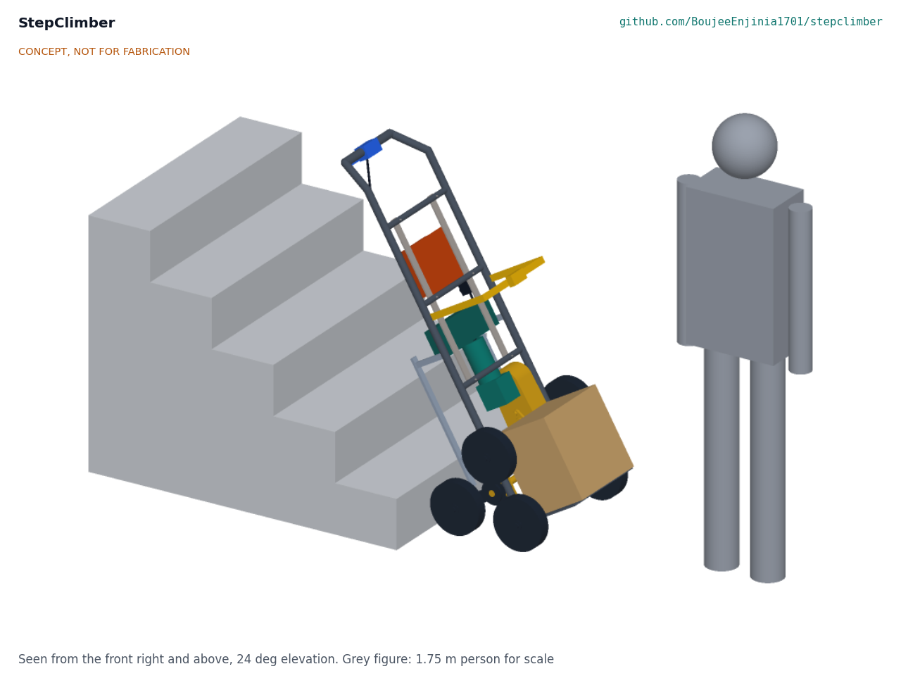
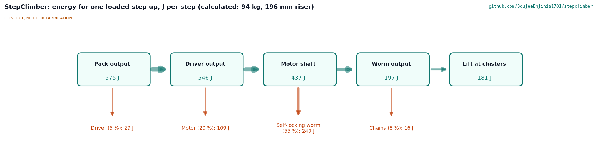
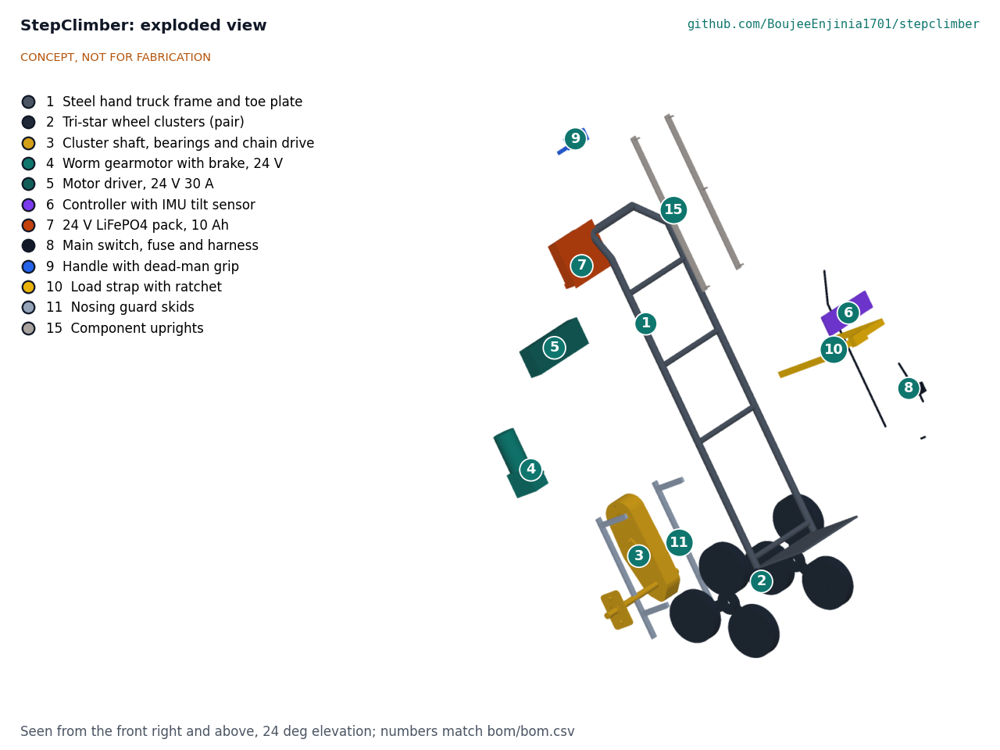

# StepClimber design precis

StepClimber is a steel hand truck whose two wheels are replaced by a pair of powered tri-star clusters on one shaft. A 24 V worm gearmotor with a built-in brake turns the clusters, through a two-stage chain drive, one third of a turn per step, lifting 60 kg of parcels up a residential stair while the courier walks ahead and steadies the handle. An IMU on the frame watches the tilt angle, shapes the motor speed so the courier can hold the load near its balance point, and stops the climb if the angle drifts. This version carries the cluster and drive rework and the tighter tilt window Amish decided on 2026-09-25 (SCM-DDR-002), in which 200 mm wheels on 150 mm arms keep every steel part clear of stair nosings, and the constructable design of SCM-DDR-003 (2026-10-01), in which every part is fixed to its neighbours: bearings on axle plates welded inside the rails, a closed chain case, a countershaft in two bearings and the electronics on uprights. The calculations (SCM-CAL-001 v0.3) give about 1,215 loaded steps per charge from a 256 Wh LiFePO4 pack and a 34.2 kg truck. **Three requirements are not met on paper:** the truck mass (R5, 27 kg), the climb speed (R3: the 250 W motor climbs 16.3 of the 17 steps per minute at the new mass) and the grip force, 121 N at the plus or minus 6 degree tilt window edge (R6); options are proposed, awaiting Amish. Value-engineering target: USD 650. Estimated cost of the constructable design: USD 776 (USD 126 over the target). The prototype build plan is SCM-BLD-001 ([docs/05-build-plan.md](05-build-plan.md)).

*Figure 1. StepClimber tilted back for climbing at the foot of a residential stair (196 mm risers, 254 mm treads), with a parcel carton on the toe plate and a 1.75 m person for scale. Rendered from the TRL 3 model with the 2026-09-25 rework (`cad/src/model.py`). The stair and carton are context only.*

## How it works

1. **Load.** The courier stacks parcels on the toe plate against the frame and tightens the ratchet strap. On the flat the truck rolls on two wheels of each cluster like any hand truck; the gearmotor holds the clusters still and each wheel spins freely on its own axle.
2. **Set.** At the foot of the stair the courier backs the truck up to the first riser, tilts it back to the balance point (about 30 degrees from vertical for a typical load), squeezes the dead-man grip and presses "up". The controller stores the current frame angle as the set angle.
3. **Climb.** The gearmotor turns the cluster shaft through a 7:1 two-stage chain drive in a closed chain case (a countershaft in the case carries the first-stage driven sprocket and the small final-stage sprocket). The lower rear wheel of each cluster presses against the riser and becomes the pivot; the cluster turns about it until the top wheel lands on the tread above, then turns about the landed wheel for the rest of the third of a turn. Each one-third turn lifts the truck one step, and the courier rolls it back on the landed wheel to the next riser (about 84 mm on the design stair). The courier walks up backwards one step ahead, holding the handle.
4. **Hold the angle.** The frame pitches as the clusters roll over each nosing. The IMU reads the frame angle at 100 Hz or faster. The controller slows the motor near the end of each third of a turn so the landing wheel does not thump, and slows further if the angle moves away from the set angle so the courier can correct it. If the angle leaves a window of plus or minus 6 degrees, or the range 15 to 45 degrees back from vertical, the motor stops and the spring-applied brake holds, and a light bar and buzzer on the handle tell the courier which way to move the handle.
5. **Descend.** "Down" drives the clusters backwards at the same controlled speed. The worm drive is self-locking, so the load cannot run away down the stair; the motor drives the descent rather than a brake restraining it.
6. **Stop.** Releasing the grip, a fault, a flat battery or a pulled pack all leave the truck held on the step by the self-locking worm and the motor's spring-applied brake.

Tilt control keeps the operator in the loop. The truck has only the clusters on the stair and the courier's hands on the handle, so it cannot hold its own angle; the IMU makes the climb slow down and stop in a way that helps the courier hold it. Amish decided this reading on 2026-09-25, and the pitch now says "a tilt sensor that helps the courier hold the load angle steady" (SCM-DDR-001 item 1).

*Figure 2. Energy for one loaded step up, in joules per step, from the pack to the lift at the clusters. Design load case of 94 kg total on a 196 mm riser. Values from SCM-CAL-001 v0.3 (calculated, not measured).*

## Main components

Numbers match the exploded view (Figure 3) and `bom/bom.csv`.

*Table 1. Main components.*

| # | Component | Proposed choice | Notes |
| --- | --- | --- | --- |
| 1 | Hand truck frame | Steel loop-handle hand truck, 28 mm rails 400 mm apart, grip 1,260 mm from the shaft, 380 x 240 mm toe plate; lowest cross bar moved below the shaft line; axle plates, skid standoffs and component uprights added (BOM lines 14 to 16) | Commercial frame modified; about 8 kg |
| 2 | Tri-star wheel clusters (pair) | Laser-cut steel spiders, 150 mm hub-to-wheel arms, weld-on taper-lock hubs, 20 mm stub axles, three 200 mm solid rubber wheels on sealed bearings each | Wheel spacing about 260 mm; non-marking tread; about 6.3 kg |
| 3 | Cluster shaft and two-stage chain drive | 25 mm keyed shaft in two flange bearings on the axle plates; 20 mm countershaft in two flange bearings, 144 mm up the frame; first stage 06B 10T to 35T, final stage 08B 10T to 20T (7:1 overall); all in a closed chain case (line 14) | Case inside the nosing envelope (R15 met) |
| 4 | Worm gearmotor with brake | 24 V brushed, about 250 W, worm gearbox about 40 rpm output and 30 N·m rated, spring-applied electromagnetic brake (wheelchair type) | Self-locking worm plus brake: two independent holds |
| 5 | Motor driver | 24 V, 30 A brushed H-bridge with current sensing and a brake output | Current limit caps cluster torque |
| 6 | Controller with IMU | Small microcontroller, 6-axis IMU, light bar and buzzer, in a sealed box with item 5, on the component uprights | Tilt window, speed shaping, hold-to-run logic |
| 7 | Battery pack | 24 V LiFePO4, 8S, 10 Ah (256 Wh), BMS, quick-release cradle | About 2.6 kg |
| 8 | Main switch, fuse and harness | Key switch, 40 A fuse near the pack, keyed connectors | |
| 9 | Handle controls | Dead-man grip lever, up and down thumb switch, status light bar | Works with gloves |
| 10 | Load strap | Ratchet strap across the load, fixed to the frame | Stops parcels sliding off when pitching |
| 11 | Nosing guard skids | UHMW polyethylene strips on welded standoffs behind the rails, 100 mm behind the shaft line | Protect stairs if the frame touches a nosing |
| 12 | Charger | 29.2 V, 3 A LiFePO4 charger | No exploded-view callout |
| 13 | Enclosure and hardware | Sealed box, fasteners, cable ties | No exploded-view callout |
| 14 to 17 | Parts added to make the design buildable | Axle plates and chain case, component uprights, frame modification steel, fixings (SCM-DDR-003) | Uprights are callout 15; the case is part of callout 3 |

*Figure 3. Exploded view with numbered callouts matching the BOM.*

## Key numbers

All values are from SCM-CAL-001 v0.3, printed by `docs/04-calcs/sizing.py`. They are paper calculations, not measurements. The design load case is a 60 kg payload on a 34.2 kg truck (94.2 kg total) on a stair with 196 mm risers and 254 mm treads. The clusters are assumed to carry the whole weight while lifting, which is conservative.

### Cluster geometry and nosing clearance

A tri-star cluster climbs by pivoting about the wheel pressed against the riser. With a wheel-center spacing *d* and riser *h*, the landing wheel's center comes down sqrt(*d*² minus *h*²) from the pivot's center, and its contact point lands that distance less the 100 mm wheel radius past the riser face.

*Table 2. Cluster geometry.*

| Quantity | Value | Basis |
| --- | --- | --- |
| Arm length (hub to wheel center) | 150 mm (was 135 mm) | Decided 2026-09-25, SCM-DDR-002 |
| Wheel diameter | 200 mm (was 150 mm) | Decided 2026-09-25, SCM-DDR-002 |
| Wheel-center spacing *d* | 259.8 mm | 150 mm x sqrt(3) |
| Hub height on the flat | 175.0 mm | 100 mm wheel radius + 150 mm x sin 30° |
| Cluster overall diameter | 500 mm | 2 x (150 + 100) mm |
| Landing past a square nosing, 196 mm riser | 70.5 mm | sqrt(259.8² minus 196²) minus 100 |
| Landing past a square nosing, 200 mm riser | 65.8 mm | |
| Largest riser with 30 mm of landing | 225 mm | R2 range of 100 to 200 mm covered |
| Longest tread needed (100 mm riser) | 240 mm | R2 treads of 250 mm or more covered |
| Closest approach of a nosing to the shaft line | 87.1 mm (square nosing), 64.2 mm (32 mm overhang) | Section 3 of SCM-CAL-001 |
| Largest radius allowed on the shaft line | 77 mm (square), 54.2 mm (32 mm overhang) | Less a 10 mm margin |
| Chain case radius on the shaft line | 53.9 mm | R15 met, sized to the limit |
| Countershaft guard clearance to the nearest nosing | 80 mm | R15 met |
| Every frame-fixed outline near the shaft to the nearest nosing | 10.3 mm or more | R15 met (10 mm wanted) |
| Nosing overhang the spider arms clear | 32 mm, 19.5 mm to spare at worst | R2 met |

The nosing passes through the gap between the two lower arms, close to the shaft, as the swinging wheel lands. On the v0.1 cluster the 60-tooth sprocket and its guard struck every nosing. The larger wheels hold the pivot farther from the riser and higher, which moves the hub away from the nosing, and the small 08B final sprocket fits in the space left. The chain case, axle plates and bearings of the constructable design all stay inside that space.

### Drive, speed and torque

Assumptions: 17 steps per minute, so one third of a turn every 3.5 s (5.67 rpm, 0.593 rad/s at the shaft); drive efficiencies as in SCM-REQ-001.

*Table 3. Drive.*

| Quantity | Value | Basis | Requirement |
| --- | --- | --- | --- |
| Lift work per step | 181 J | 94.2 kg x 9.81 m/s² x 0.196 m | |
| Mean shaft torque | 86 N·m | 181 J / 2.09 rad | |
| Peak shaft torque | 140 N·m static, 182 N·m with a 1.3 factor | Full load on the 150 mm arm, plus the grip force | |
| Peak shaft power | 108 W | 182 N·m x 0.593 rad/s | |
| Peak motor output | 260 W | 108 W / (0.95 x 0.97 chain stages x 0.45 worm) | **R3 not met**, 4 % over a 250 W motor (16.3 steps/min) |
| Gearmotor output | 28.2 N·m at 40 rpm | 182 N·m / (7 x 0.95 x 0.97) | Inside a 30 N·m rating |
| Final stage (08B, 10T to 20T, 38 links) chain pull | 4,478 N | Safety factor 4.0 | |
| First stage (06B, 10T to 35T, 54 links) chain pull | 1,764 N | Safety factor 5.0 | |

R3 was revised to 17 steps per minute on 2026-09-25 to keep the 250 W wheelchair motor; the heavier constructable truck now needs slightly more than that motor gives (SCM-DDR-003 item A2).

### Energy and endurance

*Table 4. Energy.*

| Quantity | Value | Basis | Requirement |
| --- | --- | --- | --- |
| Pack energy per loaded step up | 575 J (0.16 Wh) | 181 J / (0.95 x 0.80 x 0.45 x 0.95 x 0.97) | |
| Pack energy per loaded step down | 46 J | Driving a self-locking worm while the load assists takes 21 % of the lift work, plus motor and driver losses | |
| Usable pack energy | 829 kJ | 256 Wh x 90 % | |
| Loaded steps per charge, up and down | 1,215 | 829 kJ / (621 J x 1.1 for standby and starts) | R4 met |
| Typical day | 25 drops of three floors (48 steps) each | | |
| Charge time | 3.5 h | 256 Wh / (87.6 W x 0.9) plus a 0.3 h constant-voltage tail | R13 met |

The self-locking worm wastes more than half the drive energy (Figure 2). It is kept because it holds the load without power (SCM-DDR-001 item 5). Its back-drive efficiency is -0.22, so it cannot be driven backwards by a static load; the 2 N·m motor brake alone would hold the load with a 7.5-times margin.

### Balance, handle force and rolling

During a step the support point moves under the hub: the hub goes from 29 mm on the stair side of the support wheel to 150 mm beyond it. With the frame angle held, the center of mass swings plus or minus 89 mm about the support point even at the best set angle, and a further 52 mm at the edge of the plus or minus 6 degree window.

*Table 5. Handle force.*

| Quantity | Value | Requirement |
| --- | --- | --- |
| Grip force at the set angle, worst point of a step | 76 N | |
| Grip force at the plus or minus 6 degree window edge | 121 N | **R6 not met** |
| Widest window that keeps the grip force at 100 N | Plus or minus 3.1 degrees | Options proposed (SCM-DDR-002 item 14, SCM-DDR-003 item A3) |
| Push force on the flat | 28 N | R10 met |

The longer arm that fixes the nosing clearance also widens the swing of the load (plus or minus 71 mm on the v0.1 cluster), so the tighter window decided on 2026-09-25 does not bring the grip force under 100 N.

### Structure

At the 182 N·m peak and a 3 g dropped-step load, the safety factors on yield are 1.4 for the keyed 25 mm shaft (its bearings now sit inside the frame, 93 mm from the wheel plane), 1.5 for the 6 mm spider arms and 2.6 for the 28 mm frame rails (R1 met statically; fatigue not assessed).

### Mass and size

*Table 6. Mass and size.*

| Item | Value |
| --- | --- |
| Frame 8.0, clusters 5.5 and stub axles 0.8, shafts, bearings, sprockets and chains 5.5, gearmotor 4.5, electronics 0.8, pack 2.6, harness 0.5, handle controls 0.6, strap 0.4, skids 0.4, hardware 0.5, axle plates and chain case 2.5, uprights 0.6, skid standoffs 0.5, added fixings 0.5 kg | 34.2 kg (**R5 not met** at 27 kg) |
| Overall width at the wheel faces; over the wheel end screws | 569 mm; 588 mm (R11 met) |
| Upright height, fixed handle | 1,451 mm (R11 met at 1,500 mm) |
| Folded height with a hinge 950 mm above the shaft (Option C study) | 1,139 mm; not adopted |

### Cost

Value-engineering target: USD 650. Estimated cost of the constructable design: USD 776 including the charger (USD 126 over the target). See `bom/bom.csv` and the value-engineering section of the design decisions register ([docs/06-design-decisions.md](06-design-decisions.md)).

## Key design choices

Items marked **decided** were decided by Amish on 2026-09-25 (SCM-DDR-001 and SCM-DDR-002), going with the recommendation.

- **Tri-star clusters rather than a stepping arm or tracks (decided).** Tri-stars are simple, roll on the flat without extra parts and are well understood. Stepping-arm climbers carry more and handle more stair shapes, and tracks are smoothest, but both are harder to build in a garage and cost more ([XSTO overview](https://www.xstoclimbers.com/blogs/news/3-types-of-stair-trolley-tri-star-vs-support-arm-vs-tracked-systems)). The cost of the tri-star is the thump at each nosing, a fixed stair range and, as SCM-CAL-001 shows, very little room near the shaft.
- **Operator-in-the-loop tilt control (decided).** Speed shaping, a tilt window, stop and alert, with no actuated load platform. The pitch was reworded to match.
- **Self-locking worm plus spring-applied brake (decided).** Two independent holds on a stair, at the cost of more than half the drive energy.
- **24 V LiFePO4, not the 48 V SwapCell pack (decided).** The drive needs about 240 W peak and 230 Wh per shift; LiFePO4 is the more forgiving chemistry for a pack that is dropped in and out of vans. SwapCell would add a CAN host adapter and cost more than half the budget. The SwapCell interface v0.3 items do not apply.
- **Fixed handle for the first prototype (decided).** R11 is relaxed to 1,500 mm; the 1,451 mm truck meets it. A folding hinge (Option C) was studied and not adopted.
- **Rated stair load of 60 kg (decided).** Higher than manual tri-star trucks (about 35 kg on stairs) and lower than stepping climbers (110 to 170 kg).
- **Operator above, truck below (decided).** The courier always stands uphill of the truck, going up (pulling) and going down (lowering). This goes on the labels and in the user guide.
- **Cluster and drive rework for R2 and R15 (decided).** 150 mm arms, 200 mm wheels and a two-stage chain drive with an 08B 20-tooth final sprocket. It fixes both stair-contact failures at the cost of about 2 kg, $53 and a slower climb.
- **Revised targets after the rework (decided).** R3 17 steps/min on the present 250 W motor, R5 27 kg and R12 $650, set from the priced parts.
- **Tilt window of plus or minus 6 degrees (decided).** Tightened from 8 degrees. It does not by itself meet R6 on the larger cluster.
- **Grip force after the rework (R6).** Proposed, awaiting Amish (SCM-DDR-002 item 14, SCM-DDR-003 item A3): keep plus or minus 6 degrees and relax R6 (to 125 N at the constructable mass) until grip force is measured (recommended), tighten the window, or lengthen the handle.
- **Design for construction (SCM-DDR-003).** Made on 2026-10-01 under Amish's 2026-09-30 instruction to make the design physically buildable; open for his review. Bearings on axle plates welded inside the rails, a closed chain case carrying the countershaft and gearmotor, chain centres for whole chains, weld-on hubs and stub axles, component uprights, skid standoffs and a relocated lowest cross bar. Truck mass (R5) and climb speed (R3) options are proposed, awaiting Amish.

## Safety

> **Safety:** StepClimber moves an 86 kg mass on a stair with a person directly uphill of it, has a pinch-prone chain and rotating clusters, and carries a 256 Wh lithium iron phosphate pack. A fall of the loaded truck down a stair could crush or seriously injure the operator or anyone below. Treat every item here as a hazard to design out before any loaded climb.

- **Runaway and tip-over on the stair.** The main hazard. Two independent holds (self-locking worm and spring-applied brake), hold-to-run control, the tilt window and a rated load label are all required. Nobody may stand downhill of the truck on the stair. The frame must not be able to pass over center toward the operator if the grip is released: the tilt limits of 15 and 45 degrees protect against this only if the brake holds, which is unverified.
- **Operator falls.** The courier walks backwards up the stair. Speed is limited to about 17 steps per minute and stops the moment the grip opens. The handle should leave one hand free for a stair rail where possible; this is an open question.
- **Pinch and entanglement.** The clusters rotate with up to about 182 N·m and the chain runs near the operator's feet. The chains and sprockets are enclosed in a closed chain case; the cluster spiders have no open gaps large enough for fingers when the truck is at rest; clothing and straps must be kept clear.
- **Lithium iron phosphate pack.** LiFePO4 is less prone to thermal runaway than other lithium-ion chemistries but can still vent and burn if crushed, shorted or overcharged. Use a pack with a BMS and cell-level protection, fuse the output (item 8), charge on a non-combustible surface away from sleeping areas, and never charge a damaged or wet pack. Charging below 0 °C must be blocked by the BMS.
- **Stair and building damage, and nosing strike.** Rubber wheels and skids protect nosings. After the rework no steel part reaches a nosing on paper, but the chain case is sized to the limit of its envelope on the shaft line, so a bent case or a stair outside the R2 range could still be struck. A strike could jerk the frame toward the courier or stall the climb with the load half-lifted, so the case must be kept straight and the stair range respected.
- **Loads and grip force.** Unsecured parcels can slide as the frame pitches. The strap is mandatory. Loads with a high center of mass (tall boxes) shift the balance angle and raise the handle force, which already reaches 121 N at the window edge on the design load.

## Open questions

Open decisions are indexed in the design decisions register ([docs/06-design-decisions.md](06-design-decisions.md)).

- Decide how to close R6 after the rework (SCM-DDR-002 item 14), and R5 and R3 after the design for construction (SCM-DDR-003 items A1 and A2).
- Survey riser, tread and nosing sizes in walk-up buildings in the first target city (R2).
- Confirm that the worm stays self-locking under vibration and measure the brake's holding torque (R8); these need hardware and wait for TRL 4, which is on hold.
- Assess fatigue of the keyed shaft and the welded frame.
- Choose the first user group and a partner courier group (SCM-DDR-001 items 9 and 10).

Concept media: [blueprint sheet](../media/concept-blueprint.pdf), [interactive 3D model](../media/viewer.html). General arrangement: [SCM-DWG-001 Rev P4](../cad/drawings/SCM-DWG-001.pdf). Prototype build plan: [SCM-BLD-001](05-build-plan.md).
