# StepClimber prototype build plan

**Plan, not yet built.** How to build the first proof-of-concept prototype, component by component. Building and testing to it is TRL 4 work. Decisions still to be made are kept in the design decisions register ([docs/06-design-decisions.md](06-design-decisions.md)), not here.

## 1. What you are building

*Figure 1. Every component pulled apart and numbered in build order, seen from the drive side and the back.*

The prototype is one StepClimber: a bought steel hand truck whose wheels are replaced by two powered tri-star wheel clusters on one shaft. A worm gearmotor turns the shaft through two chain stages in a closed chain case on the right-hand rail (the drive side), and an electronics box, a battery pack and a fuse box hang on two uprights behind the frame. Figure 1 shows the 24 components in the order you make or fit them. Nine are made in a small workshop: the replacement lowest cross bar, the two axle plates (one of them the outer plate of the chain case), the case inner plate, its band and spacers, the skid standoffs, the two spiders with their hubs and stub axles, the two shafts cut from keyed stock and the two component uprights. The plates and spiders are laser cut to the outlines in their making sketches. Everything else is bought and fitted: the frame, bearings, sprockets, chains, gearmotor, wheels, electronics, pack, controls, skids and strap. The work is cutting, drilling and coping steel tube, MIG welding to the frame, bending thin aluminium sheet, bolting, and wiring bought modules at 24 V. The parts are estimated at USD 776 from the bill of materials.

> **Safety:** The finished truck moves a load of up to 60 kg on a stair with a person uphill of it, has a 182 N·m drive, two chain stages and turning clusters, and carries a 256 Wh lithium iron phosphate pack. Keep the pack out until section 6 says otherwise. Welding needs a welding helmet, gloves, a fire-safe area and good ventilation; strip paint and zinc from the weld areas first. Cut steel and aluminium edges are sharp: deburr everything. No climb with a load and no stair work is part of this plan.

## 2. What changed to make it buildable

The concept showed what the truck does; several of its parts could not be made, fitted or fixed as drawn. Each change below keeps what the truck does, and all of them are recorded in decision record SCM-DDR-003, open for Amish's review.

*Table 1. Changes from the concept.*

| Component | The concept had | The buildable design has | Why |
| --- | --- | --- | --- |
| Shaft bearings | Bearings drawn inside the rails and the cluster hubs | Two axle plates welded inside the rails, a flange bearing bolted to the inside of each (Figure 5) | There is no room outside the rails for a bearing, hub, spider and wheel within the 600 mm width |
| Countershaft | One bearing, half inside a rail, both sprockets overhung | A bearing on each chain case plate, both sprockets between them (Figure 11) | A shaft with 4.5 kN of chain pull needs support on both sides |
| Chain guards | Loose rings and strips with open sides | A closed chain case: outer plate, aluminium inner plate on two spacers, aluminium band (Figures 4, 9, 11 and 13) | The guard is fixed, encloses both chains and carries the countershaft and gearmotor |
| Lowest cross bar | 60 mm above the shaft line, through the chain and the axle plates | Cut off; a new bar 105 mm below the shaft line (Figure 2) | Clears the chain case |
| Countershaft and gearmotor | On the shaft line, the large sprocket standing past the front of the rails | 15 mm toward the back | The load sits against flat rails; nothing reaches into it |
| Chain centres | Distances that needed part links | Distances for 38 and 54 whole links, with 8 mm slots to tension each chain | Chains come in whole links |
| Gearmotor | Motor parallel to the output, floating | Motor standing up the frame at right angles, gearbox face bolted to the case inner plate (Figure 10) | How a worm gearmotor is made, and a fixing where its torque reacts |
| Cluster hubs and wheels | No axles; hubs and wheels unfixed | Weld-on taper-lock hubs, welded stub axles, wheels held by a spacer, washer and end screw (Figures 14 to 16) | Bought hubs give a clamped, keyed fit without machining |
| Electronics box, pack, fuse box | Floating behind the rails | Two aluminium uprights bolted through the cross bars carry them (Figures 17 and 18) | Light, bolted, nothing welded to aluminium |
| Skids | Long strips on thin rods | 500 mm skids on four welded square-tube standoffs (Figures 7 and 8) | Straight, strong supports from the rails; skid face unchanged |
| Handle controls, strap, harness | Floating | Pod clamped round the grip, strap hooked round the rails, cables tied along the uprights | Every part has a fixing |

## 3. Making the components

Make and check each component before the assembly step that needs it. Sizes are in millimetres. "Up" is along the rails toward the handle, "back" is toward the stair side (the side the electronics hang on), "forward" is toward the load. "Left" and "right" are as seen standing at the back of the truck, looking at the electronics; the drive side is the right. Every height is measured from the **shaft line**, the line through the centre of the cluster shaft, 142.5 mm above the top of the toe plate and 40 mm behind the rail centre lines. Workshop tolerance is 0.5 mm unless a step says otherwise; drawings do not carry tolerances before TRL 4.

### 3.1 Frame changes and the replacement lowest cross bar

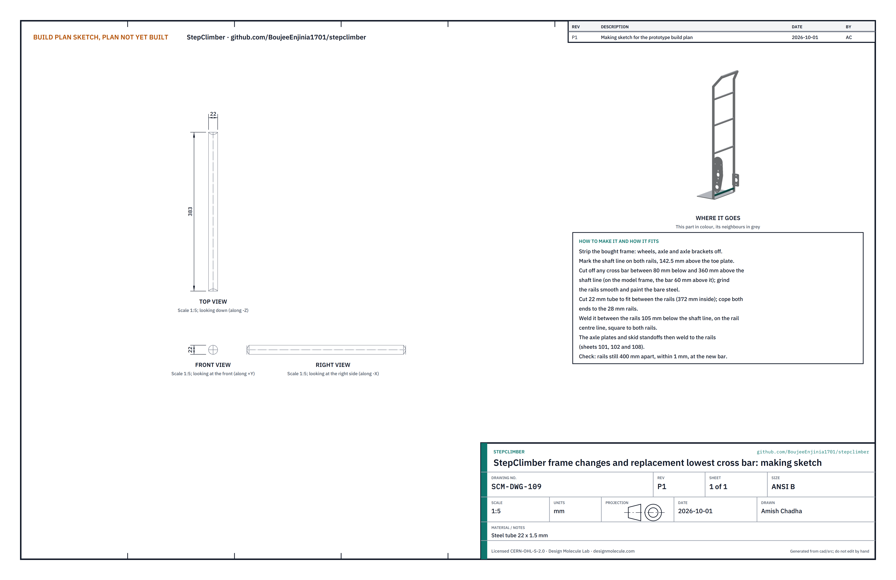

*Figure 2. Frame changes and replacement lowest cross bar (SCM-DWG-109).*

**What it is and what it is made from.** The bought hand truck is a steel loop-handle frame with 28 mm rails 400 mm apart and a 380 x 240 mm toe plate. Its lowest cross bar would pass through the chain case, so it is replaced by one lower down, cut from 22 x 1.5 mm steel tube.

**How to make it.**

1. Take the wheels, axle and axle brackets off the frame.
2. Measure 142.5 mm up each rail from the top of the toe plate and mark the shaft line all round both rails.
3. Cut off any cross bar between 80 mm below and 360 mm above the shaft line (on the frame modelled, the one 60 mm above it). Grind the rails smooth.
4. Cut a length of 22 mm tube to fit between the rails (372 mm inside) and cope both ends to the 28 mm rails.
5. Weld it between the rails 105 mm below the shaft line, on the rail centre lines, square to both rails.
6. Paint the bare steel except where the axle plates and skid standoffs will be welded.

**How it fits the parts next to it.** The new bar sits 22 mm below the bottom of the chain case and 26 mm above the toe plate (step 1). The three upper cross bars, about 380, 700 and 1,000 mm above the shaft line, carry the component uprights later.

**Check before moving on.** The rails are still 400 mm apart, within 1 mm, at the new bar and at the top.

### 3.2 Axle plate, plain side

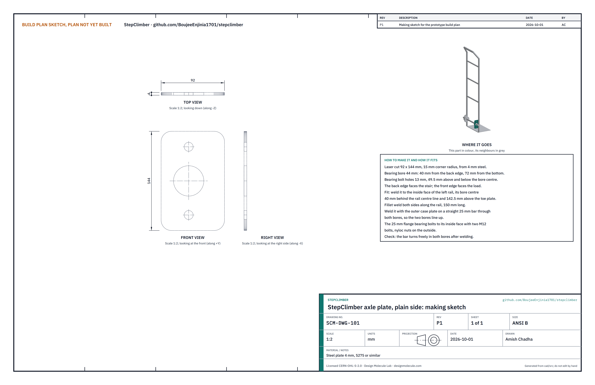

*Figure 3. Plain-side axle plate making sketch (SCM-DWG-101).*

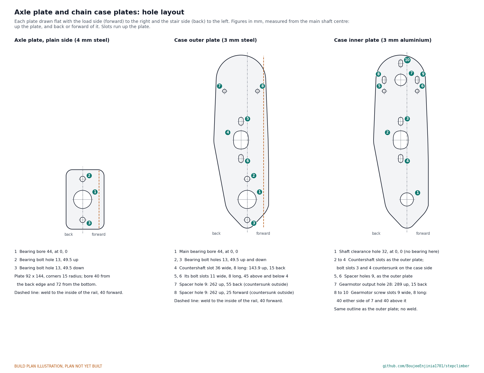

*Figure 4. Every hole in the axle plate and the two chain case plates, measured from the main shaft centre.*

**What it is and what it is made from.** The plate that carries the left-hand shaft bearing, welded to the inside of the left rail. Steel plate 4 mm, laser cut.

**How to make it.**

1. Have it laser cut 92 x 144 mm with 15 mm corners, a 44 mm bearing bore 40 mm from the back edge and 72 mm from the bottom, and two 13 mm bolt holes 49.5 mm above and below the bore (Figure 4, left).
2. Deburr. Clean the weld edge and the rail back to bright steel.
3. Cut a straight 25 mm bar about 600 mm long to use as an alignment bar for this plate and the chain case outer plate (section 3.3).

**How it fits the parts next to it.**

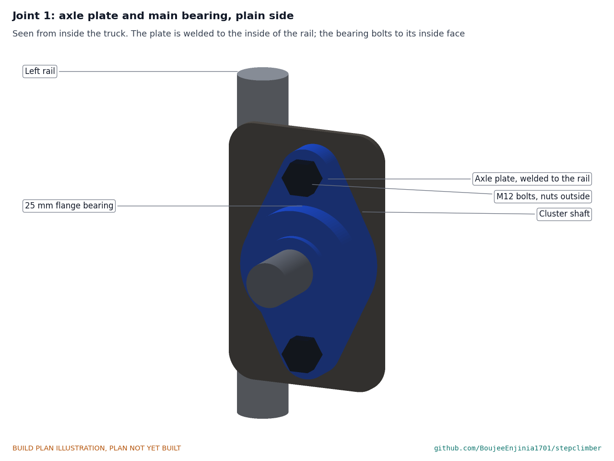

*Figure 5. Seen from inside the truck: the plate is welded to the inside of the rail and the bearing bolts to its inside face.*

The plate lies flat against the inside of the left rail with its bore centre on the shaft line, 40 mm behind the rail centre line. Weld it along the rail on both sides of the plate, 150 mm of fillet each side, with the alignment bar through its bore and the outer plate's bore (step 2). The 25 mm two-bolt flange bearing bolts to its inside face with two M12 bolts, nyloc nuts on the outside (step 4).

**Check before moving on.** After welding, the alignment bar turns freely in both bores.

### 3.3 Chain case outer plate

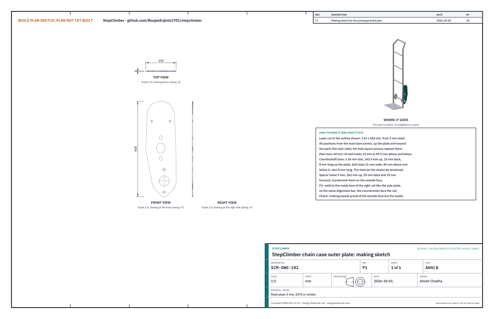

*Figure 6. Chain case outer plate making sketch (SCM-DWG-102).*

**What it is and what it is made from.** The drive-side axle plate and the outside wall of the chain case. It carries the right-hand shaft bearing and the outer countershaft bearing. Steel plate 3 mm, laser cut to the outline in Figure 6, 133 x 418 mm.

**How to make it.**

1. Have it laser cut to the outline with the holes in Figure 4 (middle): the 44 mm main bore and its two 13 mm bolt holes; a 36 mm countershaft slot 143.9 mm up and 15 mm back, 8 mm long up the plate, with two 11 mm bolt slots 45 mm above and below it, also 8 mm long; two 9 mm spacer holes 262 mm up, 55 mm back and 25 mm forward.
2. Countersink the two spacer holes on the face that will go against the rail (the outside face).
3. Deburr; clean the weld edge.

**How it fits the parts next to it.** The plate lies flat against the inside of the right rail, its main bore on the shaft line, welded like the axle plate on the same alignment bar (step 2). Its outline keeps 54 mm round the shaft line and 66 mm round the countershaft on the stair side, so no part of it comes within 10 mm of a stair nosing during a climb. On the load side it stops 2 mm behind the front of the rail. Bearings bolt to its inside face (step 4); the case band sits against the same face round its edge (step 10).

**Check before moving on.** Nothing stands proud of the outside face but the welds; the countershaft slot and its bolt slots run up the plate, parallel to the rail.

### 3.4 Skid standoffs and skids

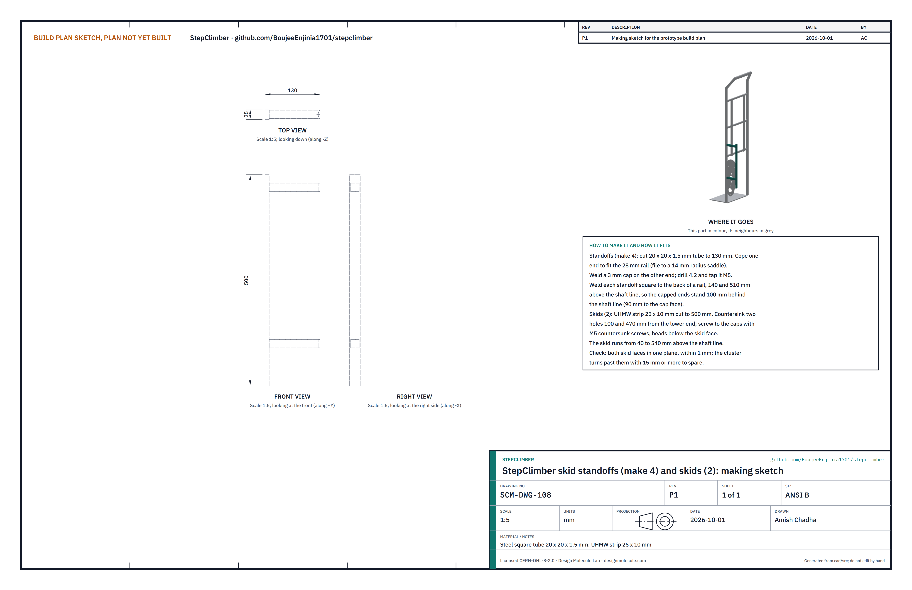

*Figure 7. Skid standoffs and skids making sketch (SCM-DWG-108).*

**What it is and what it is made from.** Four short arms welded to the backs of the rails that hold two plastic skids 100 mm behind the shaft line, where they keep the frame off the stair nosings. Steel square tube 20 x 20 x 1.5 mm with 3 mm plate caps; ultra-high molecular weight polyethylene (UHMW) strip 25 x 10 mm.

**How to make it.**

1. Cut four 130 mm lengths of square tube. Cope one end of each to fit the 28 mm rail: scribe a 14 mm radius saddle and file to it.
2. Weld a 3 mm cap on the other end of each; drill 4.2 mm in the middle of the cap and tap M5.
3. Cut two 500 mm lengths of UHMW strip. Drill and countersink two 5.5 mm holes in each, 100 and 470 mm from the lower end.

**How it fits the parts next to it.**

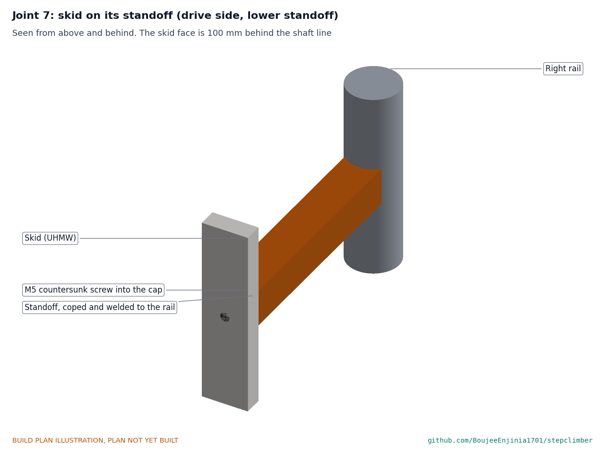

*Figure 8. The coped end of the standoff is welded to the back of the rail; the skid screws to its cap.*

The standoffs weld square to the backs of the rails, two on each rail, 140 and 510 mm above the shaft line, pointing straight back (step 3). Their caps then lie 90 mm behind the shaft line, and the skids, screwed to them with M5 countersunk screws, stand from 40 to 540 mm above it with their faces 100 mm behind it (step 16). The turning clusters pass the standoffs and skids with 15 mm to spare.

**Check before moving on.** Both skid faces lie in one plane, within 1 mm.

### 3.5 Chain case inner plate and spacers

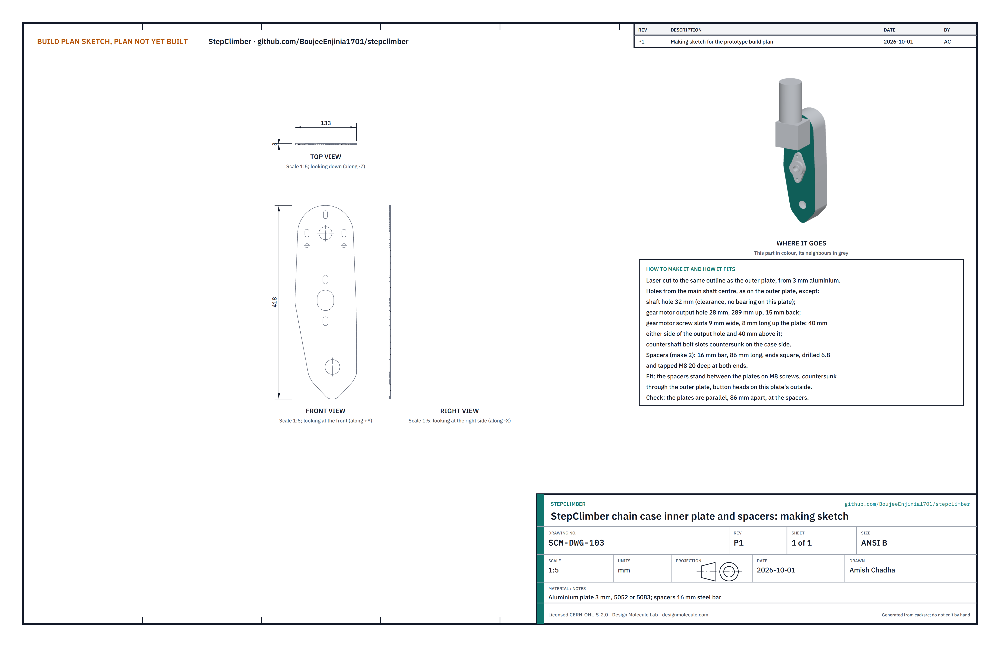

*Figure 9. Chain case inner plate and spacers making sketch (SCM-DWG-103).*

**What it is and what it is made from.** The inside wall of the chain case. It carries the inner countershaft bearing and the gearmotor, and comes off to reach the chains. Aluminium plate 3 mm (5052 or 5083), laser cut to the same outline as the outer plate; two spacers from 16 mm steel bar.

**How to make it.**

1. Have the plate laser cut with the holes in Figure 4 (right): a 32 mm clearance hole for the shaft (no bearing on this plate); the countershaft slot and bolt slots as on the outer plate; the two 9 mm spacer holes; a 28 mm hole for the gearmotor output 289 mm up and 15 mm back; three 9 mm gearmotor screw slots, 8 mm long up the plate, 40 mm either side of the output hole and 40 mm above it.
2. Countersink the two countershaft bolt slots on the case side (the side facing the outer plate).
3. Spacers (make 2): cut 16 mm bar to 86 mm, face the ends square, drill 6.8 mm and tap M8 20 deep in both ends.

**How it fits the parts next to it.**

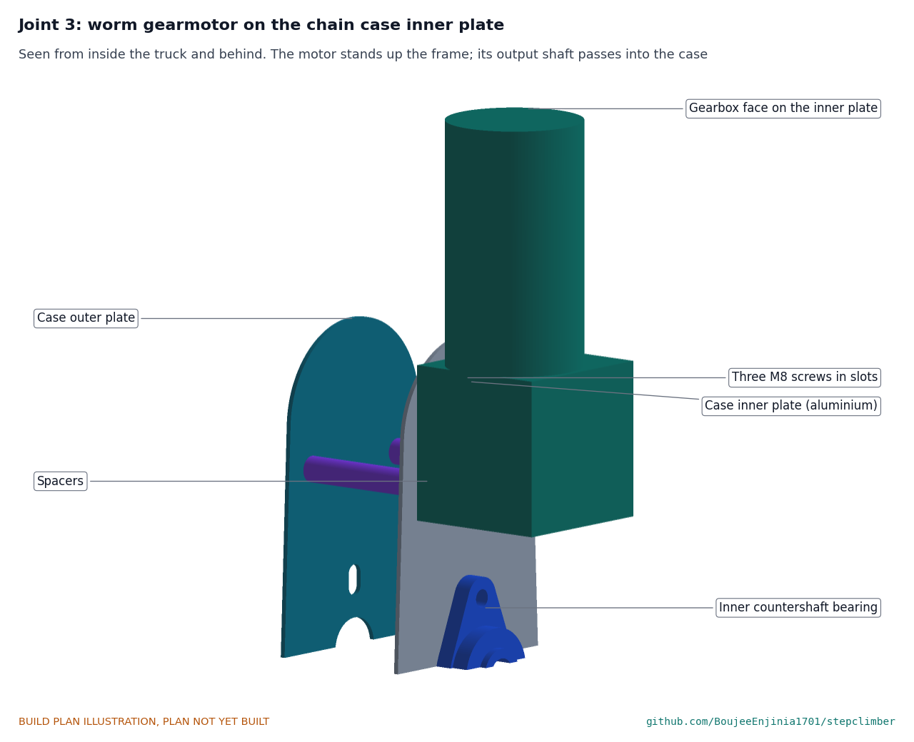

*Figure 10. Seen from inside the truck and behind: the gearbox face bolts to the inner plate; the motor stands up the frame.*

The plate stands 86 mm inside the outer plate on the two spacers, held by M8 countersunk screws through the outer plate and M8 button-head screws on the inner plate (step 5). The inner countershaft bearing bolts to its gearbox side with countersunk M10 screws from the case side, nuts on the bearing flange. The gearmotor bolts to the same side with three M8 screws through the slots; its output shaft passes through the 28 mm hole into the case (step 8).

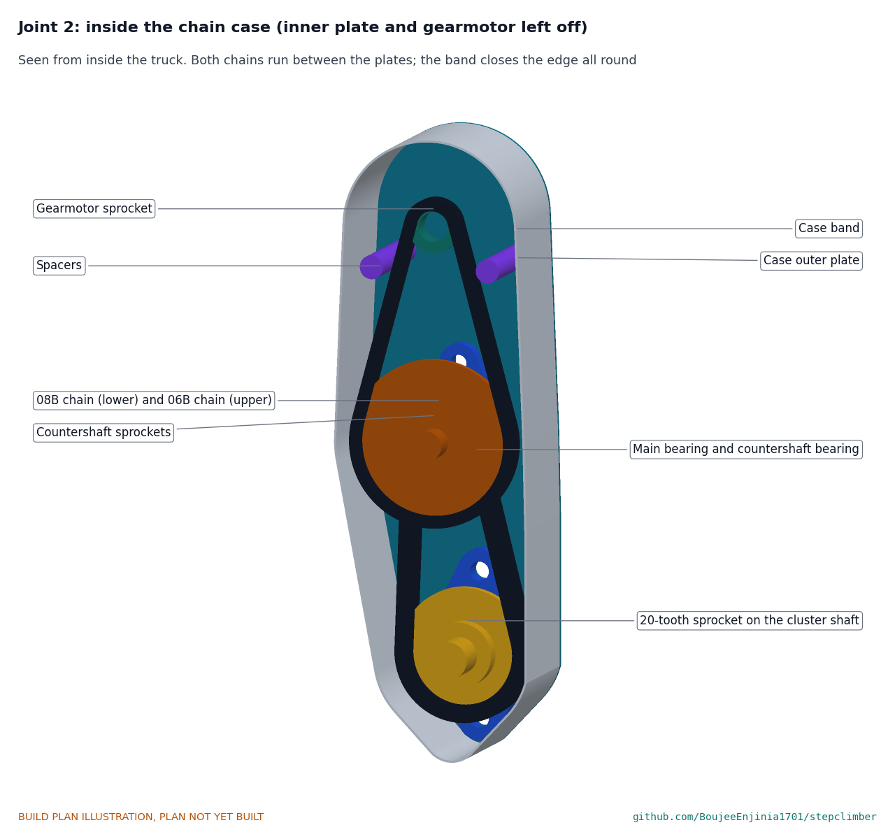

*Figure 11. Joint 2: inside the chain case, inner plate and gearmotor left off. The final-stage chain runs from the countershaft down to the shaft; the first-stage chain runs from the gearmotor down to the countershaft.*

**Check before moving on.** On a trial fit with the spacers, the plates are parallel and 86 mm apart at both spacers.

### 3.6 Cluster shaft and countershaft

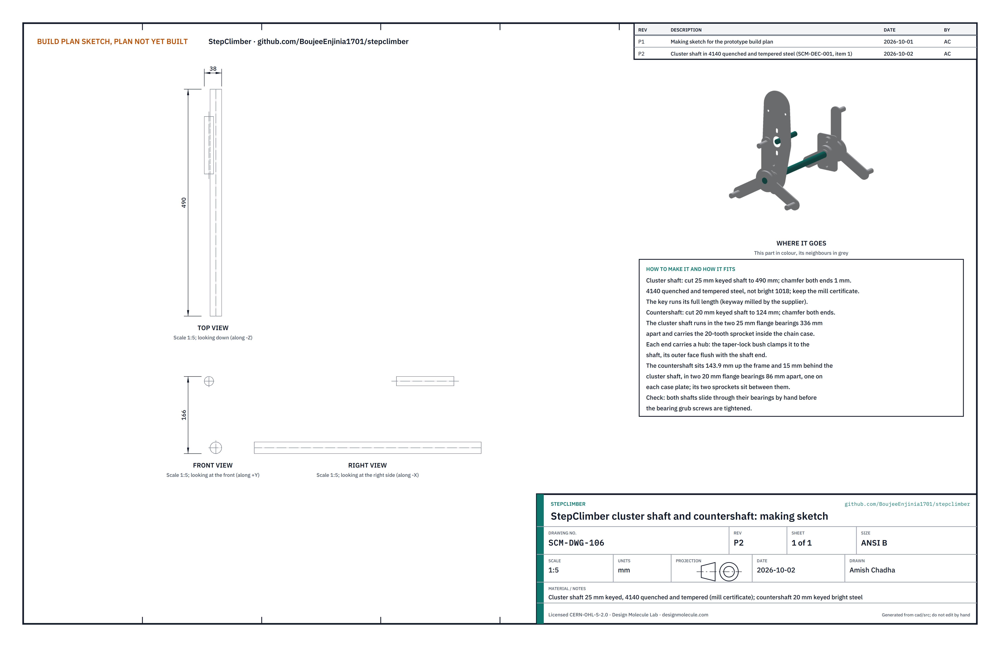

*Figure 12. Cluster shaft and countershaft making sketch (SCM-DWG-106).*

**What it is and what it is made from.** The cluster shaft carries both clusters and the 20-tooth final sprocket; the countershaft carries the two middle sprockets. Bought keyed shaft with keys: the 25 mm cluster shaft in quenched and tempered alloy steel such as 4140 (not 1018 bright bar), with a mill certificate, and have the supplier mill the keyway; the 20 mm countershaft in bright steel. The 4140 shaft is about 12 dollars dearer than bright 1018 bar and about 2.5 times as strong against a dropped step (a safety factor of 2.5 against 1.4), so do not swap in a softer bar.

**How to make it.**

1. Cut the 25 mm keyed shaft to 490 mm; chamfer both ends 1 mm.
2. Cut the 20 mm keyed shaft to 124 mm; chamfer both ends.
3. Cut keys to length for each sprocket and hub.

**How it fits the parts next to it.** The cluster shaft runs in the two 25 mm flange bearings, 336 mm apart, and sticks out 59 mm beyond each axle plate to carry a hub; the hub's outer face is flush with the shaft end. Inside the case it carries the 20-tooth 08B sprocket. The countershaft runs in the two 20 mm flange bearings, 86 mm apart, one on each case plate, and carries the 35-tooth 06B sprocket and the 10-tooth 08B sprocket between them, hub to hub. Each shaft is located by the grub screws or collars of its bearing inserts.

**Check before moving on.** Each shaft slides through its bearings and sprockets by hand before any grub screw is tightened.

### 3.7 Chain case band

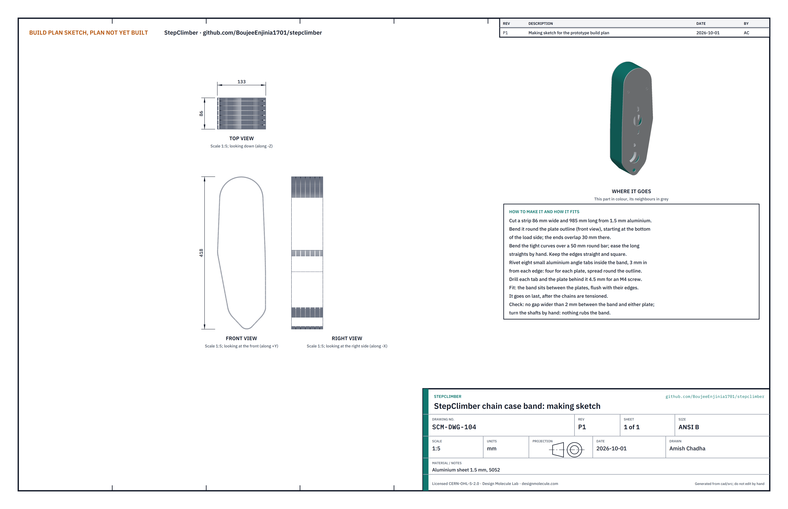

*Figure 13. Chain case band making sketch (SCM-DWG-104).*

**What it is and what it is made from.** The strip that closes the edge of the chain case all round. Aluminium sheet 1.5 mm (5052), 86 mm wide, with eight small aluminium angle tabs.

**How to make it.**

1. Cut a strip 86 mm wide and 985 mm long.
2. Starting at the bottom of the load side, bend it round the plate outline: the tight curves over a 50 mm round bar, the long straights by hand, checking against the outer plate as you go. The ends overlap 30 mm; rivet them together.
3. Rivet eight small angle tabs inside the band, 3 mm in from its edges: four along each edge, spread round the outline.
4. Hold the band between the two plates, drill each tab and the plate behind it 4.5 mm, and fit M4 screws.

**How it fits the parts next to it.** The band sits between the plates, flush with their edges, held by the M4 screws through its tabs into both plates. It goes on last, after the chains are tensioned (step 10), and comes off with the inner plate for chain work.

**Check before moving on.** No gap wider than 2 mm between the band and either plate; turning the shafts by hand, nothing rubs the band.

### 3.8 Spiders with weld-on hubs and stub axles (make 2)

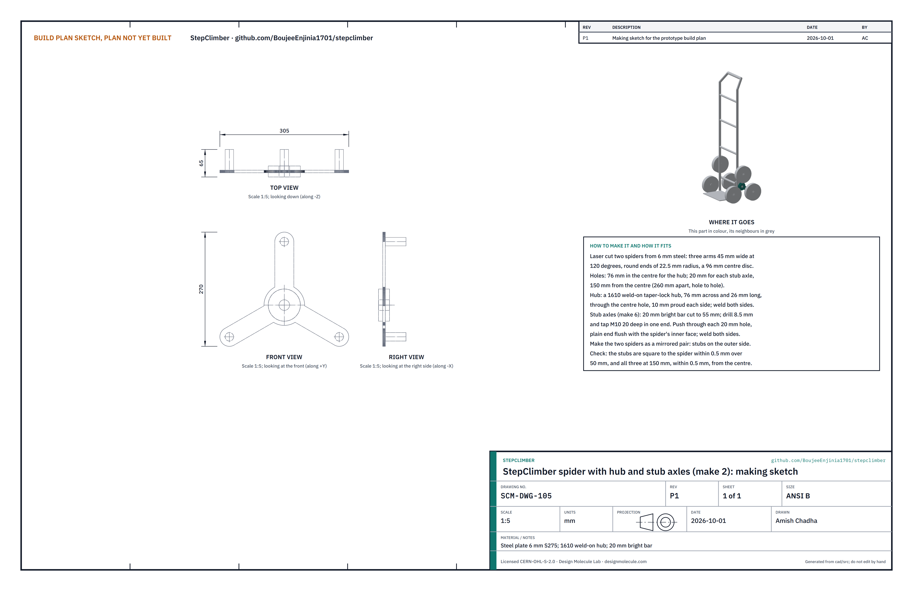

*Figure 14. Spider with hub and stub axles making sketch (SCM-DWG-105).*

**What it is and what it is made from.** Each cluster's three-armed frame. Steel plate 6 mm (S275), laser cut; a 1610 weld-on taper-lock hub with a 25 mm keyed bush; three stub axles from 20 mm bright bar.

**How to make it.**

1. Have two spiders laser cut: three arms 45 mm wide at 120°, round ends of 22.5 mm radius, a 96 mm centre disc, a 76 mm centre hole and three 20 mm axle holes 150 mm from the centre (260 mm apart, hole to hole).
2. Push a weld-on hub through the centre hole so it stands 10 mm proud each side, square to the plate, and weld it both sides.
3. Stub axles (make 6): cut 20 mm bar to 55 mm; drill 8.5 mm and tap M10 20 deep in one end.
4. Push a stub axle through each 20 mm hole, plain end flush with the spider's inner face and the tapped end outward, and weld both sides. Make the two spiders as a mirrored pair, stub axles on the outer side of each.

**How it fits the parts next to it.**

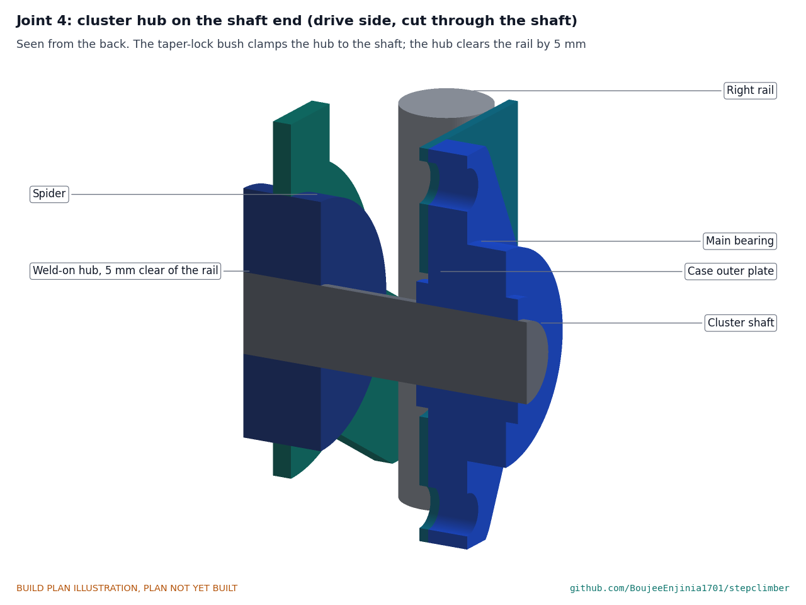

*Figure 15. Cut through the shaft: the taper-lock bush clamps the hub to the shaft end; the hub clears the rail by 5 mm.*

The hub slides onto the shaft end over the key; tightening the taper-lock bush clamps it, with its outer face flush with the shaft end (step 11). The hub's inner face then stands 5 mm outside the rail, and the spider 15 mm.

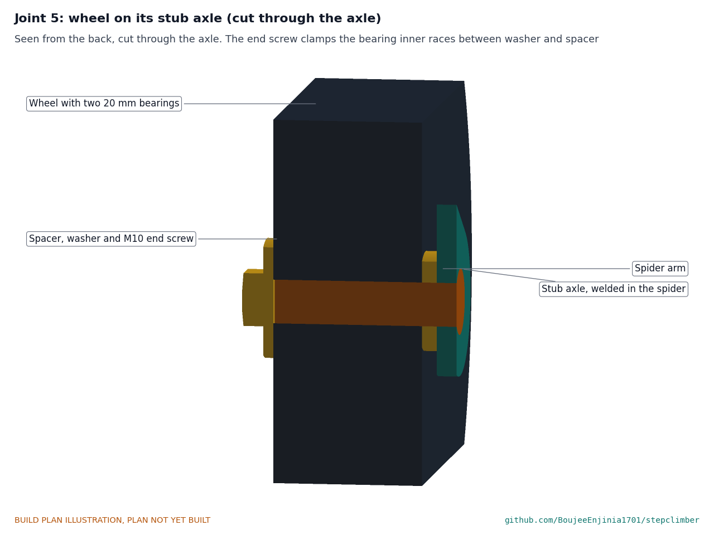

*Figure 16. Cut through the axle: spacer, wheel, washer and end screw.*

Each wheel runs on two 20 mm sealed bearings on a stub axle, between a 4.5 mm spacer against the spider and a 36 mm washer held by an M10 end screw (step 12). The stub axle is 0.5 mm shorter than the wheel and spacer together, so the screw clamps the bearing inner races and the wheel turns freely.

**Check before moving on.** The stub axles are square to the spider within 0.5 mm over 50 mm, and all three are 150 mm from the centre, within 0.5 mm.

### 3.9 Component uprights (make 2)

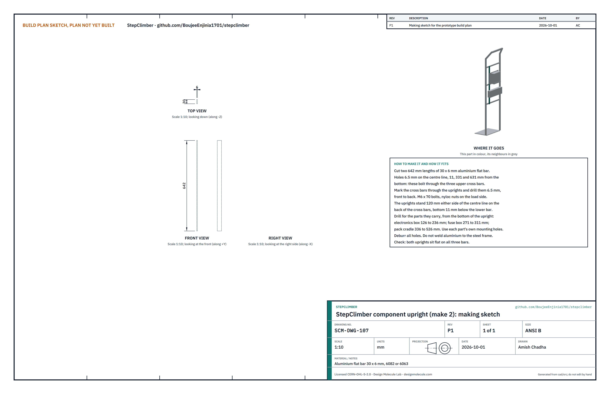

*Figure 17. Component upright making sketch (SCM-DWG-107).*

**What it is and what it is made from.** Two flat bars behind the frame that carry the electronics box, the fuse box and the pack cradle. Aluminium flat bar 30 x 6 mm (6082 or 6063).

**How to make it.**

1. Cut two 642 mm lengths.
2. Drill three 6.5 mm holes on the centre line, 11, 331 and 631 mm from the bottom.
3. Drill for the parts they carry, using each part's own mounting holes, at these heights from the bottom of the upright: electronics box 126 to 236 mm, fuse box 271 to 311 mm (right-hand upright only), pack cradle 336 to 526 mm.
4. Deburr.

**How it fits the parts next to it.**

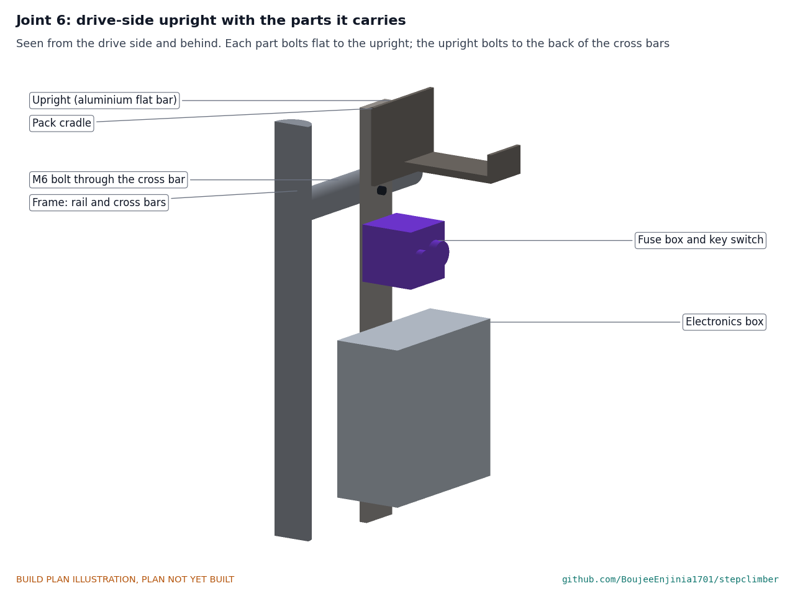

*Figure 18. Seen from the drive side: the upright bolts to the back of the cross bars, and each part bolts flat to the upright.*

The uprights stand 120 mm either side of the centre line, flat against the backs of the three upper cross bars, the bottom 11 mm below the lowest of them. Mark the cross bars through the upright holes, drill them 6.5 mm front to back, and fit M6 x 70 bolts with nyloc nuts on the load side (step 13). Do not weld aluminium to the steel frame.

**Check before moving on.** Both uprights sit flat on all three bars.

### 3.10 Wiring

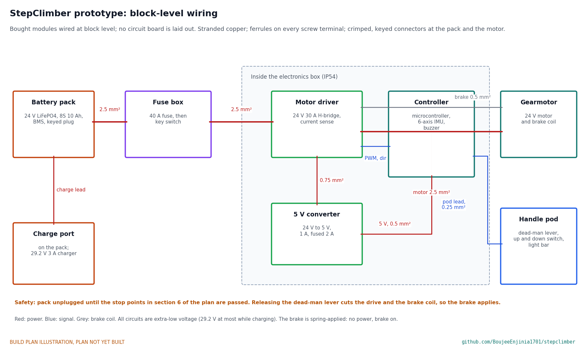

*Figure 19. Block-level wiring with wire sizes. No circuit board is laid out at this stage; bought modules are wired together.*

Wire it like this, with stranded copper, a ferrule on every screw terminal and keyed connectors at the pack and the motor:

1. Pack to the fuse box: the pack's keyed lead to the 40 A fuse, then the key switch, 2.5 mm² (14 AWG).
2. Fuse box to the motor driver supply input, 2.5 mm².
3. Motor driver output to the gearmotor's motor terminals, 2.5 mm², through the motor's keyed connector.
4. Driver brake output to the brake coil, 0.5 mm² (20 AWG). The brake is spring-applied: no power, brake on.
5. Driver supply to the 5 V converter (fused 2 A), 0.75 mm², and the converter to the controller, 0.5 mm².
6. Controller to the driver's speed and direction inputs, 0.25 mm² (24 AWG).
7. Controller to the handle pod (dead-man lever, up and down switch, light bar), a multicore lead of 0.25 mm² run up the right-hand upright and tied to the right-hand handle tube.

**Check before moving on.** With the pack out, every wire continues end to end, the supply leads read open to the frame, and every wire is labelled.

### 3.11 Bought components

Buy to specification, not brand. Line numbers are those of the bill of materials.

- **Hand truck frame (line 1).** Steel loop handle, 28 mm rails 400 mm apart, about 1,260 mm from toe plate to grip, 380 x 240 mm toe plate.
- **Wheels and hubs (line 2).** Six 200 mm solid rubber non-marking wheels, 45 mm hub length, two 20 mm bore sealed bearings each; two 1610 weld-on taper-lock hubs with 25 mm keyed bushes.
- **Drive (line 3).** 25 mm and 20 mm keyed shaft; two 25 mm and two 20 mm two-bolt flange bearings (bolt centres 99 and 90 mm); sprockets 20-tooth 08B bored 25 mm keyed, 10-tooth 08B and 35-tooth 06B bored 20 mm keyed (the 10-tooth hub no more than 27 mm across), 10-tooth 06B bored to the gearmotor shaft; 38 links of 08B chain and 54 links of 06B chain with connecting links.
- **Gearmotor (line 4).** 24 V brushed worm gearmotor, about 250 W, about 40 rpm and 30 N·m rated output, spring-applied brake, face-mounted gearbox about 95 x 90 x 95 mm, 20 mm keyed output shaft at least 25 mm long, motor at right angles to the output.
- **Electronics (lines 5, 6, 13).** 24 V 30 A brushed motor driver with current sensing and a brake output; microcontroller board with a 6-axis IMU, buzzer and light bar; IP54 box about 340 x 110 x 50 mm with standoffs and cable glands.
- **Pack (line 7).** 24 V LiFePO4, 8S 10 Ah (256 Wh), with a BMS that has cell-level protection and blocks charging below 0 °C, in a quick-release cradle.
- **Fuse box and harness (line 8).** Key switch, 40 A fuse in a sealed holder, keyed connectors, 2.5 mm² wire.
- **Handle controls (line 9).** Clamp-on pod with a dead-man lever switch, an up and down thumb switch and a light bar.
- **Strap and skids (lines 10, 11).** 25 mm ratchet strap with hooks; UHMW strip 25 x 10 mm.
- **Charger (line 12).** 29.2 V 3 A LiFePO4 charger.
- **Fixings (line 17).** Four M12 x 40 and four M10 x 35 bolts with nyloc nuts, two M10 countersunk screws with nuts (bearings); six M10 x 20 end screws, six 36 mm washers and six 4.5 mm spacers (wheels); three M8 screws (gearmotor); two M8 countersunk and two M8 button-head screws (spacers); six M6 x 70 bolts with nyloc nuts (uprights); four M5 countersunk screws (skids); sixteen M4 screws and rivets (band); medium threadlocker; cable ties.

## 4. Putting it together

In each picture the parts already fitted are grey and the parts being fitted are in colour, with an arrow showing the way they go in.

### Step 1: replacement lowest cross bar

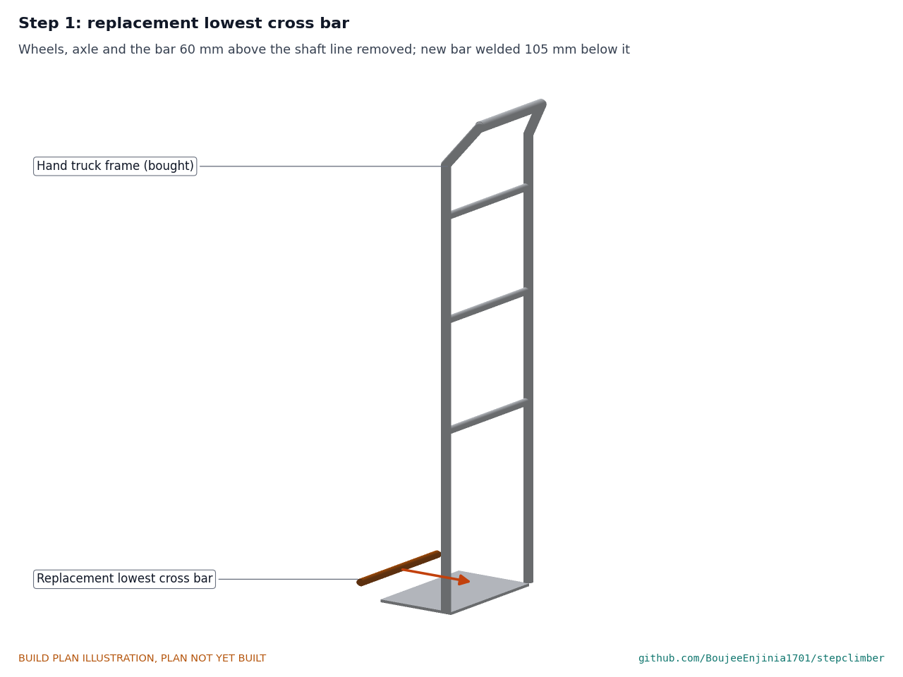

Frame stripped and the bar 60 mm above the shaft line cut off (section 3.1). Weld the new bar between the rails 105 mm below the shaft line.

### Step 2: axle plate and case outer plate onto the rails

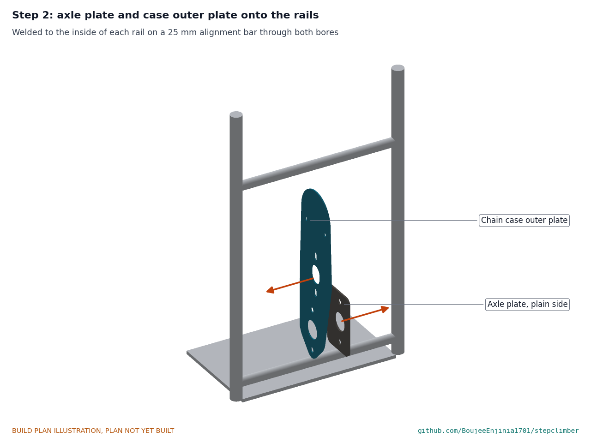

Clamp both plates to the insides of the rails with the alignment bar through both bores, the bar on the shaft line and 40 mm behind the rail centre lines, square to both rails. Tack each plate, check the bar still turns, then weld both sides of each plate along the rail. Let it cool and check again. **Hold point:** the bar turns freely in both bores.

### Step 3: skid standoffs onto the rails

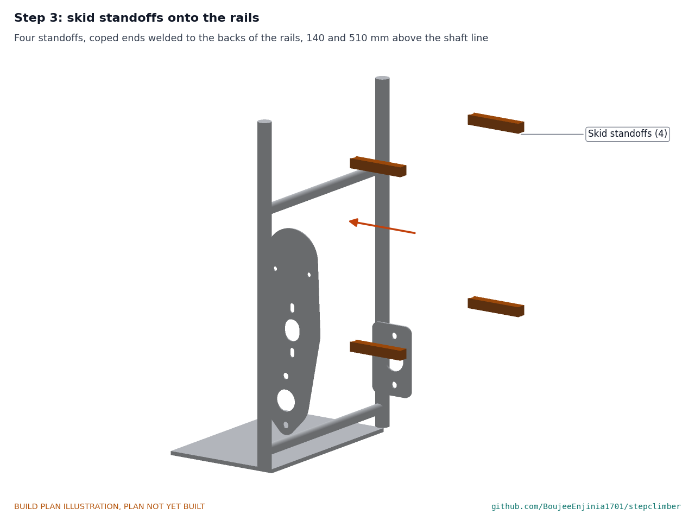

Weld the four standoffs to the backs of the rails, 140 and 510 mm above the shaft line, square to the rails and pointing straight back. Paint the frame where it is bare.

### Step 4: main bearings and outer countershaft bearing

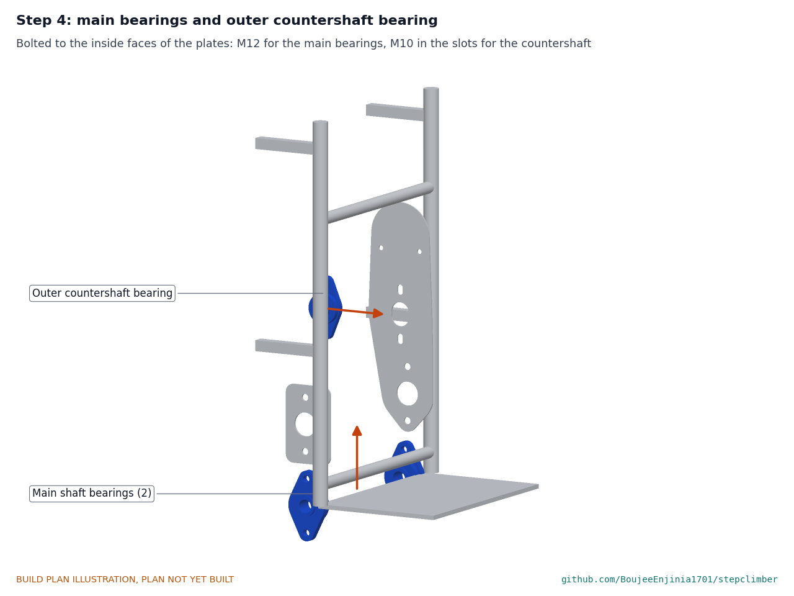

Bolt a 25 mm flange bearing to the inside face of each axle plate with two M12 bolts, nuts outside, snug but not tight. Bolt the outer 20 mm bearing to the inside of the case outer plate with two M10 bolts through the slots, at the middle of the slots.

### Step 5: case inner plate, spacers and inner countershaft bearing

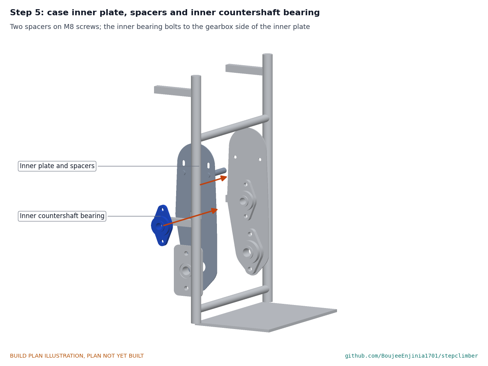

Screw the two spacers to the outer plate with M8 countersunk screws from outside. Bolt the inner 20 mm bearing to the gearbox side of the inner plate (countersunk M10 screws from the case side, nuts on the flange), at the middle of the slots. Put the inner plate on the spacers with two M8 button-head screws.

### Step 6: cluster shaft and 20-tooth sprocket

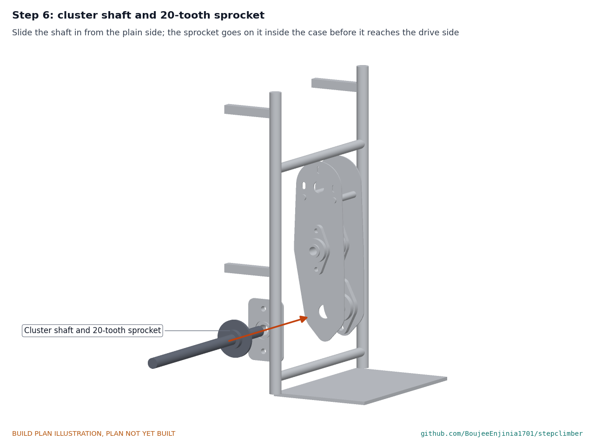

From the left, slide the shaft through the left bearing and across the frame, through the inner plate's clearance hole, through the 20-tooth sprocket held inside the case, and into the right bearing. Centre the shaft so it stands 59 mm past each axle plate; fit the sprocket key. Tighten the four main bearing bolts.

### Step 7: countershaft and its sprockets

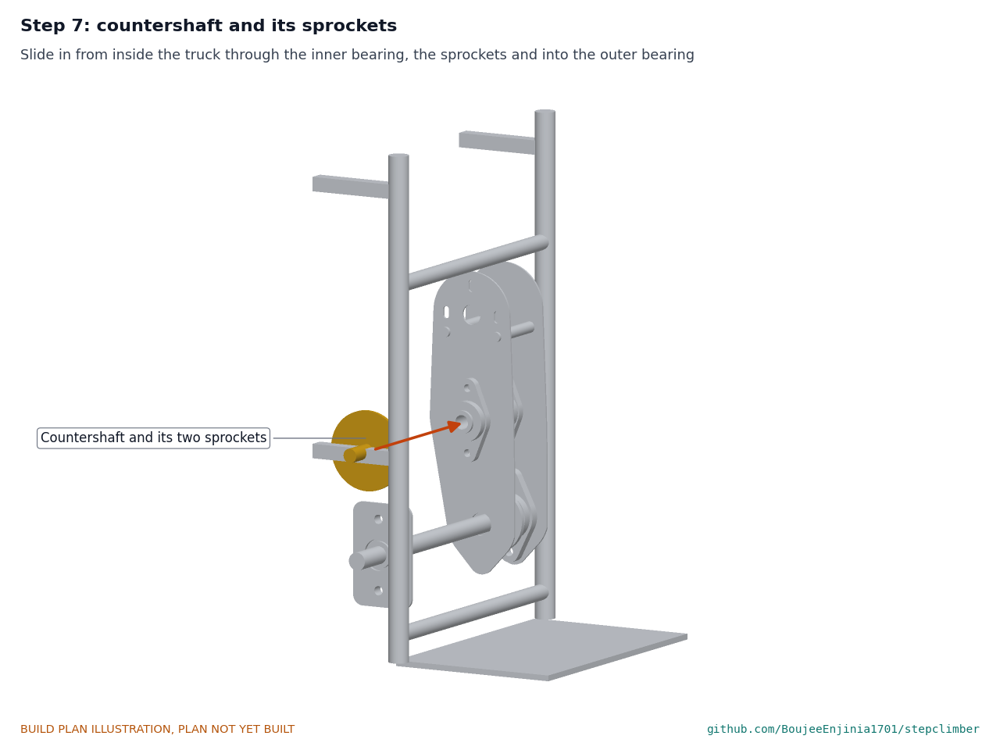

Hold the 35-tooth and 10-tooth sprockets inside the case, hub to hub, and slide the countershaft in from inside the truck through the inner bearing, both sprockets and into the outer bearing. Fit the keys; line the 10-tooth sprocket up with the 20-tooth sprocket on the cluster shaft using a straight edge.

### Step 8: worm gearmotor

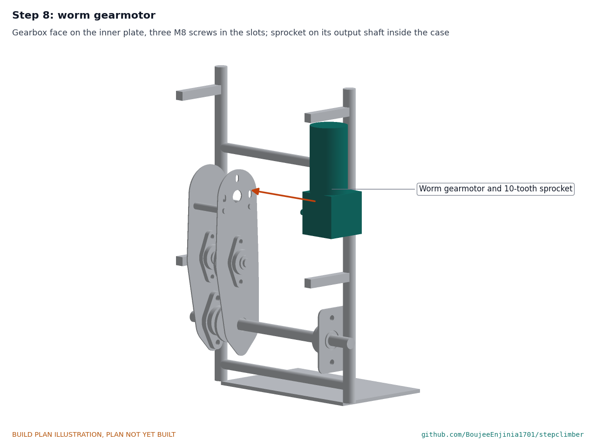

Fit the 10-tooth 06B sprocket on the gearmotor output, then put the output through the inner plate from the gearbox side and fit three M8 screws through the slots, at the middle of the slots, finger tight. Line the gearmotor sprocket up with the 35-tooth sprocket.

### Step 9: chains on, then tension them

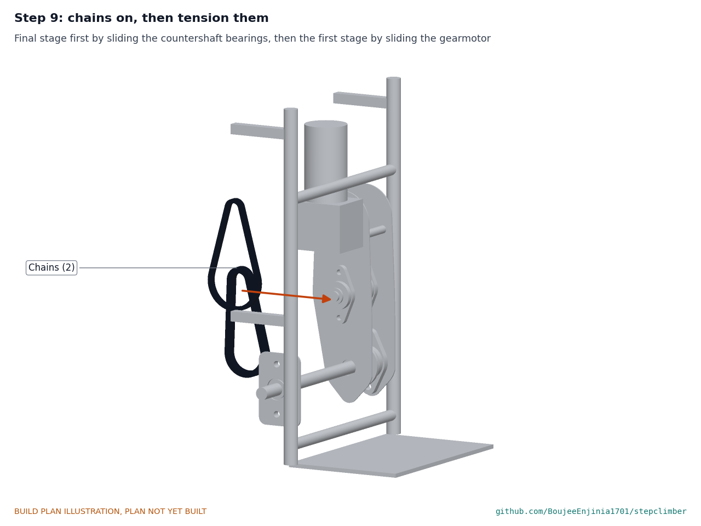

Fit the 38-link 08B chain round the 20-tooth and 10-tooth sprockets and close it with its connecting link, clip closed end leading. Slide both countershaft bearings up their slots until the chain has about 4 mm of slack midway, then tighten their bolts. Fit the 54-link 06B chain the same way, slide the gearmotor up its slots to the same slack and tighten its three screws. Tighten every bearing grub screw. **Hold point:** both shafts turn by hand through a full turn with no tight spot, and the sprockets line up within 1 mm.

### Step 10: close the chain case with the band

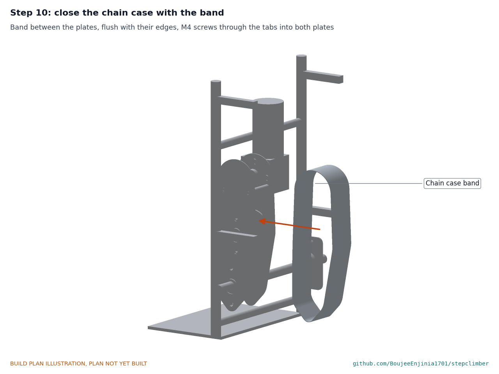

Fit the band between the plates, flush with their edges, with M4 screws through its tabs into both plates.

### Step 11: spiders onto the shaft ends

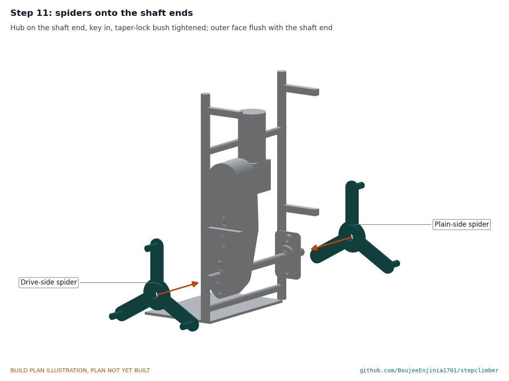

Fit the key, slide each spider's hub onto the shaft end with the stub axles outward, set the hub's outer face flush with the shaft end and tighten the taper-lock bush to its maker's torque. Set both spiders at the same angle, one arm straight up.

### Step 12: wheels onto the stub axles

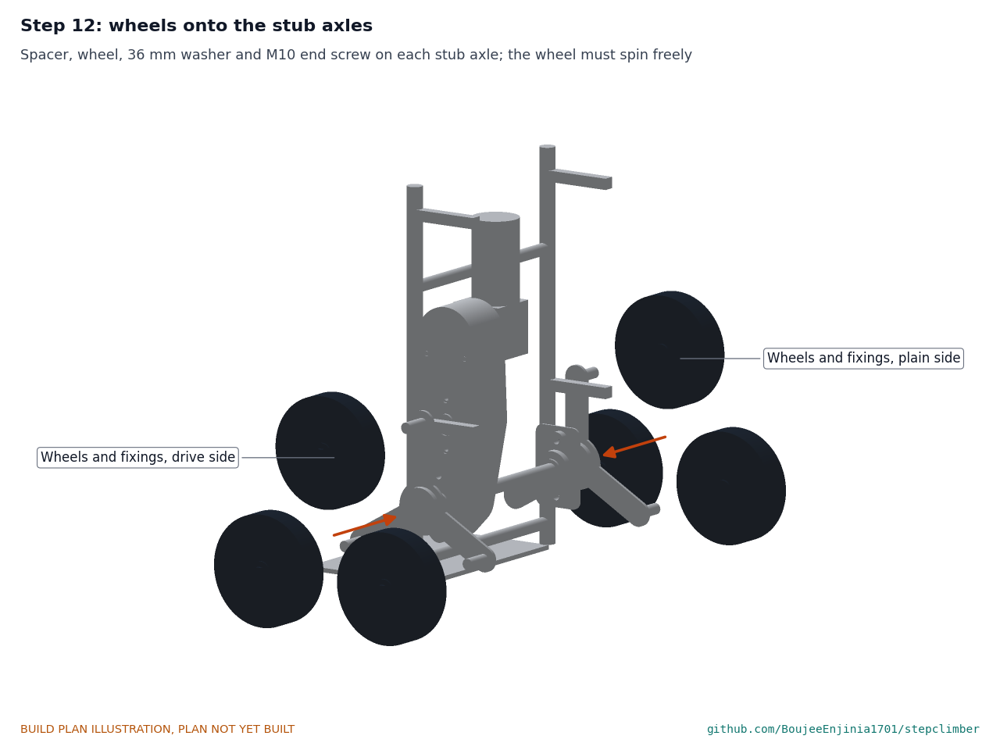

On each stub axle: spacer, wheel, washer and an M10 end screw with medium threadlocker, tightened to about 25 N·m. Spin each wheel: it must turn freely.

### Step 13: component uprights onto the cross bars

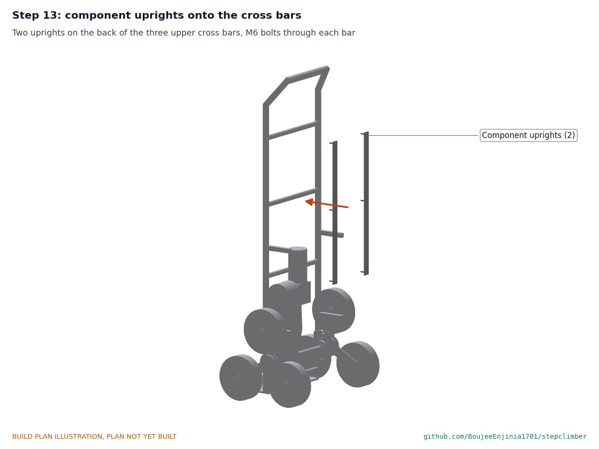

Stand the truck upright. Clamp each upright to the backs of the three upper cross bars, 120 mm either side of the centre line, drill the bars through the upright holes and fit the M6 bolts with nyloc nuts on the load side.

### Step 14: electronics box, fuse box and pack cradle

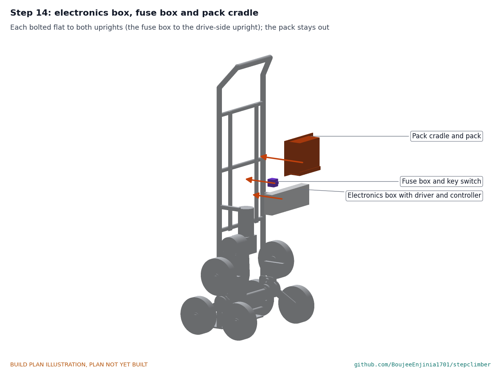

Bolt the electronics box (with the driver and controller already fitted inside on their standoffs) flat to both uprights, its lid toward the back. Bolt the fuse box to the right-hand upright and the pack cradle to both. Leave the pack out.

### Step 15: harness and handle controls

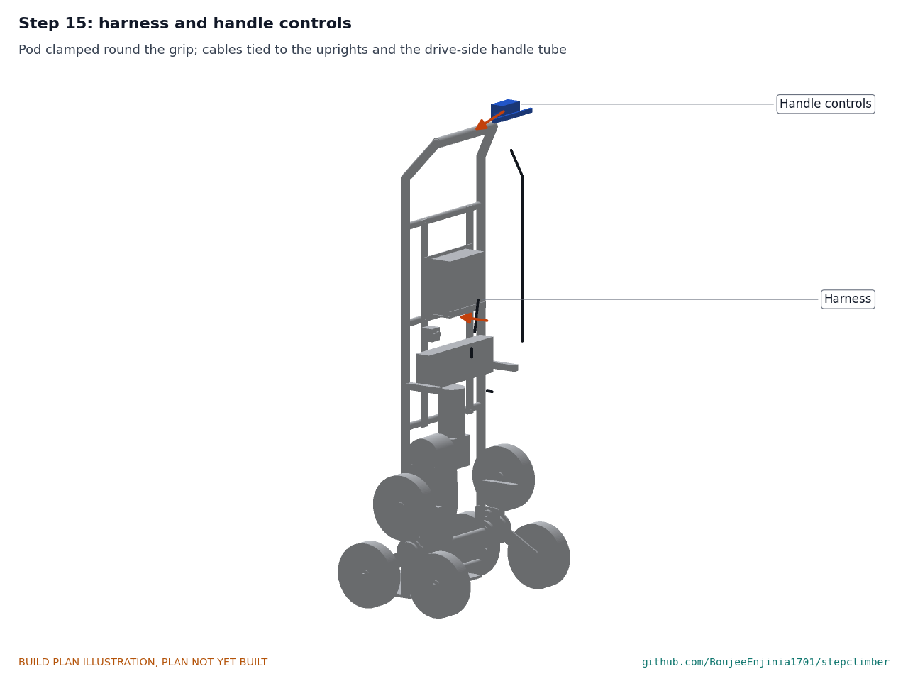

Clamp the control pod round the middle of the grip, lever behind. Run and tie the cables as in section 3.10: pack to fuse box, fuse box to electronics box, electronics box to motor, and the controls lead up the right-hand upright and handle tube to the pod. **Hold point:** the wiring checks of section 3.10 pass before going on.

### Step 16: skids and load strap

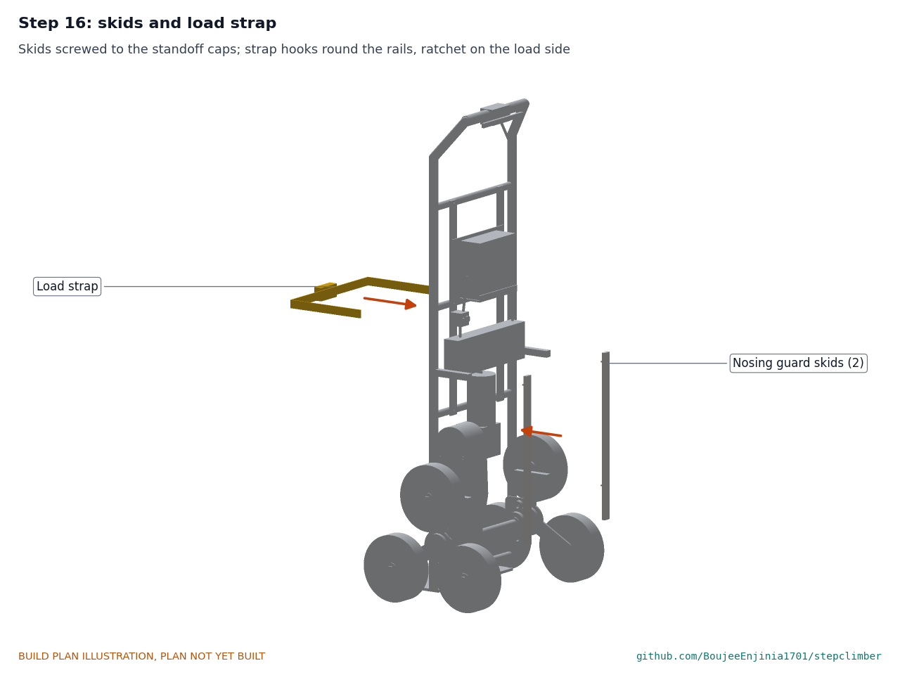

Screw the skids to the standoff caps with M5 countersunk screws. Hook the strap round the rails about 650 mm above the shaft line, ratchet on the load side.

## 5. First checks

These are the checks a TRL 4 test report would record; this plan only lists them. Requirement numbers are those of SCM-REQ-001.

*Table 2. First checks.*

| Check | Requirement | How | Pass when |
| --- | --- | --- | --- |
| Clusters turn clear | R11, R15 | Pack out, brake released by hand as the motor maker describes; turn each cluster through a full turn | Nothing touches the frame, standoffs or skids; 15 mm or more everywhere |
| Width and height | R11 | Tape measure, truck upright | 600 mm or less over the wheel end screws; 1,500 mm or less tall |
| Mass | R5 | Weigh the truck with the pack | Recorded against the 34.2 kg estimate |
| Drive and brake, unloaded | R3, R8, R9 | Wheels off the floor; pack in; hold the dead-man lever and press up, then down | Clusters turn both ways at 16 steps/min speed (one third of a turn in 3.75 s); releasing the lever stops them within 0.2 s and the brake holds |
| Hold with power off | R8 | Wheels off the floor; pack out; a 140 N·m torque on a cluster by a lever and spring balance | The cluster does not turn |
| Tilt stop | R7 | Truck on the flat, wheels chocked, drive running; tilt the frame past 3° from the set angle (the window for the first loaded trials) and past 15° and 45° from upright | The drive stops and the buzzer sounds each time |
| Push on the flat | R10 | 60 kg on the toe plate, strapped; spring balance on the grip | 40 N or less at walking pace |
| Chain case clearance | R15 | Gauge the case on the shaft line against a 54 mm radius template | The case is inside the template all round on the stair side |
| Charging | R13 | Charger on the pack, on the charging spot | The BMS charges to 29.2 V and stops; the pack stays under 45 °C |

## 6. Safety stops

Stop at each point. Carry on only when everything listed is true.

- **S1. Before welding.** Paint and any zinc ground off the weld areas; a fire-safe area clear of the electronics, the pack and anything flammable; welding helmet, gloves and ventilation.
- **S2. Before the pack comes into the workshop.** Pack voltage about 24 to 27 V; no swelling, dents or damage; BMS datasheet from its maker. A charging spot on a non-combustible surface, away from sleeping areas, with a fire extinguisher for electrical fires within reach.
- **S3. Before the pack is first plugged in.** With the pack out, every supply lead reads open to the frame; the 40 A fuse is in its holder; the key switch is off; the wheels are off the floor (truck on a stand or blocks).
- **S4. Before the drive first turns.** Chain case closed; hands, sleeves and cables clear of the clusters; the dead-man lever stops the drive within 0.2 s and the brake applies with the power off.
- **S5. Before any load goes on the toe plate.** The power-off hold check of section 5 passes; the strap is fitted; every bearing bolt, hub bush and wheel end screw is tight.
- **S6. Before any use on a stair (outside this plan).** All first checks pass, with the results recorded in a TRL 4 test plan. Nobody stands below the truck on a stair.

## 7. Tools, skills and workspace

**Tools.** MIG welder for 1.5 to 6 mm steel; angle grinder with cutting and flap discs; hacksaw or bandsaw; bench drill or a drill in a stand; drills 4 to 13 mm and a 32 mm step drill or hole saw; countersink; M5, M8 and M10 taps and tap drills; tube coping by file (14 mm half-round) or a hole saw notcher; flat and half-round files; deburring tool; scriber, engineer's square, steel rule, calipers and tape measure; 50 mm round bar and a vice for bending the band; hand rivet tool; clamps and the 25 mm alignment bar; spanners and sockets 8 to 19 mm; hex keys; torque wrench covering 10 to 60 N·m; chain breaker; straight edge; spring balance to 200 N; scale to 50 kg; multimeter; ferrule crimper and wire strippers; soldering iron.

**Skills.** Basic metalwork (marking out, cutting, drilling, tapping, coping tube, bending thin sheet) and MIG welding of light steel, by a competent welder; fitting bearings, sprockets and roller chain; crimping and screw-terminal wiring. All circuits are extra-low voltage (29.2 V at most, while charging); no mains wiring is part of the build, and the charger is a certified, undamaged unit.

**Workspace.** A floor area about 2 x 2 m with a bench; a welding area apart from the electronics and the pack; a stand or blocks that hold the truck upright with its wheels clear of the floor; the charging spot of S2.

**Personal protective equipment.** Welding helmet, welding gloves and flame-resistant clothing for welding; safety glasses for cutting, grinding and drilling; hearing protection for grinding; cut-resistant gloves for sheet and bar; no gloves near a turning drill.

## 8. Where the numbers come from

- Model and constructability checks: `cad/src/model.py` (`python cad/src/model.py --check`, 90 checks); STEP and STL exports in `cad/step/` and `cad/stl/`.
- Pictures: `cad/src/build_plan_media.py`, using `.kit/build_views.py`; written to `docs/05-build-plan/` and `cad/drawings/SCM-DWG-101` to `SCM-DWG-109`.
- General arrangement: `cad/drawings/SCM-DWG-001.pdf`, Rev P5.
- Calculations: `docs/04-calcs/01-sizing.md` (SCM-CAL-001 v0.5) and `docs/04-calcs/sizing.py`: chain centres and pulls (section 4), nosing clearances of the frame-fixed outlines (section 3), structure (section 8), mass (section 9).
- Bill of materials: `bom/bom.csv`.
- Decisions: `docs/decisions/0003-design-for-construction.md` (SCM-DDR-003), with SCM-DDR-001 and SCM-DDR-002; the register `docs/06-design-decisions.md` (SCM-DEC-001).
- Requirements: `docs/03-requirements.md` (SCM-REQ-001 v0.5).
